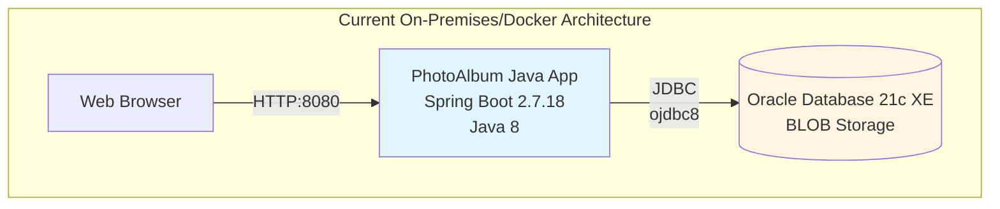
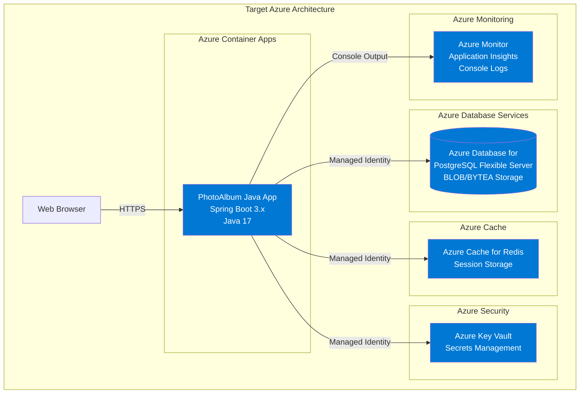

# Modernization Plan

**Branch**: `001-migrate-photoalbum-to-azure` | **Date**: 2025-12-08

---

## Modernization Goal

Migrate the PhotoAlbum Java application to Azure cloud platform with modern Azure services, including upgrading to the latest Java version, migrating from Oracle Database to Azure Database for PostgreSQL, containerizing the application, and deploying to Azure Container Apps.

## Scope

This modernization plan covers the following scope:

1. **Java Upgrade**
   - JDK (8 → 17) [required for modern Spring Boot and Azure compatibility]
   - Spring Boot (2.7.18 → 3.x) [to leverage latest features and security updates]

2. **Migration To Azure**
   - Migrate database from Oracle Database to Azure Database for PostgreSQL [based on application analysis and Azure best practices]
   - Migrate plaintext credentials to Azure Key Vault [to secure database credentials]
   - Migrate file-based logging to console logging [to support cloud-native monitoring with Azure Monitor]
   - Enable session persistence with Azure Cache for Redis [to support scalable, distributed deployments]

3. **Containerize the application**
   - Generate optimized Dockerfile for Azure deployment [application already has Dockerfile but needs optimization for Azure]

4. **Generate deployment files**
   - Generate Azure infrastructure as code (Bicep) files
   - Deploy application to Azure Container Apps

## Application Information

### Current Architecture

**Current Components:**
- **Application Framework**: Spring Boot 2.7.18 with Java 8
- **Database**: Oracle Database 21c Express Edition
  - Connection via JDBC with Oracle JDBC driver (ojdbc8)
  - Photos stored as BLOBs in database
  - Database credentials in application.properties (plaintext)
- **Storage**: Database BLOB storage for photos
- **Logging**: File-based logging with DEBUG level
- **Session Management**: Local in-memory session storage
- **Build Tool**: Maven 3.9.6
- **Containerization**: Docker with multi-stage build

## Clarification

No open issues identified. The migration path is clear based on the application analysis:
- Oracle to PostgreSQL migration is the recommended path for Azure
- Managed Identity authentication will be used for Azure Database for PostgreSQL
- Azure Cache for Redis will provide distributed session management
- Azure Monitor will replace file-based logging

## Target Architecture

**Target Components:**
- **Application Framework**: Spring Boot 3.x with Java 17
- **Compute**: Azure Container Apps (serverless containers)
- **Database**: Azure Database for PostgreSQL Flexible Server
  - Managed Identity authentication (passwordless)
  - BYTEA storage for photo data
- **Cache**: Azure Cache for Redis for distributed session management
- **Security**: Azure Key Vault for secrets management
- **Monitoring**: Azure Monitor and Application Insights via console logging
- **Build Tool**: Maven (latest compatible version)
- **Infrastructure**: Azure Bicep templates

## Task Breakdown

### 1. Upgrade Spring Boot to 3.x
- **Task Type**: Java Upgrade
- **Description**: Upgrade Spring Boot from 2.7.18 to 3.x, which includes upgrading JDK to 17, Spring Framework to 6.x, and migrating from JavaEE (javax.*) to Jakarta EE (jakarta.*)
- **Solution Id**: spring-boot-upgrade

### 2. Migrate from Oracle DB to PostgreSQL
- **Task Type**: Migration To Azure
- **Description**: Migrate the database from Oracle Database to Azure Database for PostgreSQL, including converting Oracle-specific SQL dialects, BLOB storage to BYTEA, and updating JDBC driver and configuration
- **Solution Id**: oracle-to-postgresql

### 3. Migrate from Plaintext Credentials to Azure Key Vault
- **Task Type**: Migration To Azure
- **Description**: Remove hardcoded database credentials from application.properties and migrate them to Azure Key Vault for secure storage and access
- **Solution Id**: plaintext-credential-to-azure-keyvault

### 4. Migrate to Azure Database for PostgreSQL with Managed Identity
- **Task Type**: Migration To Azure
- **Description**: Configure the application to use Managed Identity for passwordless authentication to Azure Database for PostgreSQL, eliminating the need for credential management
- **Solution Id**: mi-postgresql-azure-sdk-public-cloud

### 5. Enable Session Persistence with Azure Cache for Redis
- **Task Type**: Migration To Azure
- **Description**: Migrate from local in-memory session storage to Azure Cache for Redis for distributed session management, enabling horizontal scaling and high availability
- **Solution Id**: local-session-to-azure-redis-cache

### 6. Migrate to Console Logging
- **Task Type**: Migration To Azure
- **Description**: Migrate from file-based logging to console logging to support cloud-native applications and enable integration with Azure Monitor and Application Insights
- **Solution Id**: log-to-console

### 7. Deploy to Azure
- **Task Type**: Deploy
- **Description**: Generate Azure infrastructure files (Bicep templates) for Azure Container Apps, Azure Database for PostgreSQL, Azure Cache for Redis, and Azure Key Vault. Deploy the containerized application to Azure Container Apps with all required Azure resources.
- **Solution Id**: N/A (deployment task)

---

**Total Tasks**: 7

**Estimated Migration Effort**: Medium to High
- Java and Spring Boot upgrade: Moderate effort (automated with potential manual fixes)
- Database migration: High effort (schema changes, BLOB to BYTEA conversion)
- Azure services integration: Medium effort (configuration and authentication)
- Deployment: Low effort (automated with Bicep templates)
