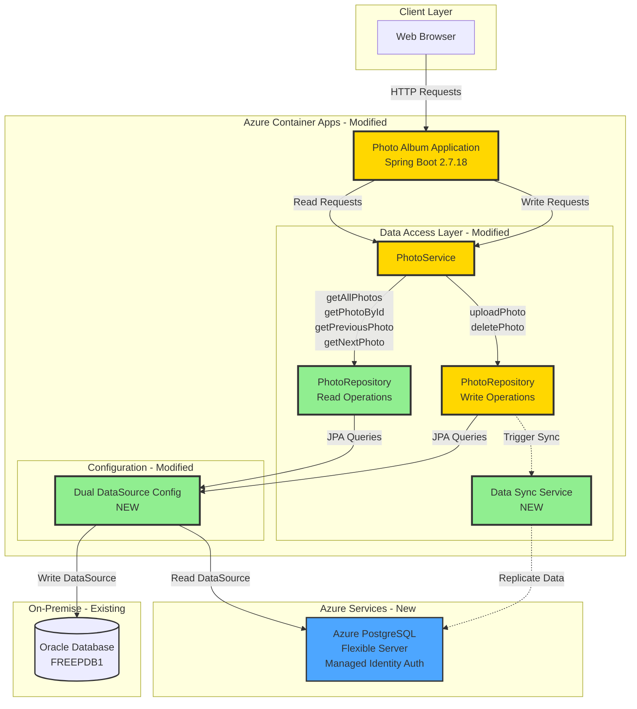

# Migration Plan: Migrate Oracle Reads to Azure PostgreSQL

**Project**: Photo Album Application  
**Migration Strategy**: Dual-database read/write split with Azure PostgreSQL for reads and Oracle on-premise for writes  
**Date**: December 8, 2025  
**Branch**: 003-migrate-oracle-reads-to-azure

---

## Technical Framework

- **Language**: Java 1.8
- **Framework**: Spring Boot 2.7.18
- **Build Tool**: Maven 3.9.6
- **Current Database**: Oracle 19c (on-premise)
- **Target Database**: Azure Database for PostgreSQL Flexible Server
- **Key Dependencies**: Spring Data JPA, Hibernate, Oracle JDBC Driver (ojdbc8)

---

## Overview

This migration modernizes the Photo Album application by splitting database operations between on-premise Oracle (for writes) and Azure Database for PostgreSQL (for reads). The application currently stores and retrieves all photo data from an on-premise Oracle database using BLOB storage. The new architecture will:

- Migrate all read operations to Azure Database for PostgreSQL with managed identity authentication for enhanced security
- Keep all write operations on the on-premise Oracle database to maintain data consistency at the source
- Implement a dual-datasource configuration to route read and write operations to their respective databases
- Synchronize photo data from Oracle to PostgreSQL after each write operation to ensure read consistency
- Deploy the application to Azure Container Apps for cloud-native scalability

The migration follows a phased approach: configure dual datasources, refactor read operations, add synchronization logic, create comprehensive tests for reads, deploy to Azure, and maintain the GitHub issue with progress updates.

---

## Services

### Azure Database for PostgreSQL Flexible Server
- **Resource ID**: `/subscriptions/a4ab3025-1b32-4394-92e0-d07c1ebf3787/resourceGroups/qianwens/providers/Microsoft.DBforPostgreSQL/flexibleServers/qianwenpg`
- **Server Name**: qianwenpg.postgres.database.azure.com
- **Database**: photoalbum_db
- **Authentication**: Managed Identity
- **Purpose**: Handle all read operations for photo data with optimized queries for Azure PostgreSQL

### Azure Container Apps
- **Resource ID**: To be provisioned
- **Purpose**: Host the containerized Photo Album application with dual-database configuration

### Azure Container Registry
- **Resource ID**: To be provisioned (if not already available)
- **Purpose**: Store and manage Docker images for deployment

### Oracle Database (On-Premise)
- **Connection**: jdbc:oracle:thin:@oracle-db:1521/FREEPDB1
- **Authentication**: Username/Password (photoalbum/photoalbum)
- **Purpose**: Continue handling all write operations (uploads and deletes) as the source of truth

---

## Architecture Design

**Legend**:
- 🟢 **Green**: New components to be created (Read repository, Sync service, Dual datasource config)
- 🟡 **Yellow**: Existing components to be modified (PhotoService, Write repository, Web app)
- **Gray**: Unchanged components (Oracle database remains as-is for writes)
- **Blue**: Azure services (PostgreSQL with managed identity)

---

## Code Migration

### Feature 1: Dual DataSource Configuration

**Description**: Configure Spring Boot to use two separate datasources - Oracle for writes and Azure PostgreSQL for reads with managed identity authentication

**Steps**:
1. **Code**: 
   - Add PostgreSQL JDBC driver dependency to pom.xml
   - Add Azure Identity libraries for managed identity support
   - Create DataSourceConfig class with @Primary write datasource (Oracle) and @Qualifier read datasource (PostgreSQL)
   - Configure PostgreSQL connection with managed identity token provider
   - Set up separate EntityManagerFactory and TransactionManager for each datasource
   - Update application.properties with dual datasource configurations

2. **Unit Test**: 
   - Mock datasource beans and verify correct configuration loading
   - Test that write datasource points to Oracle and read datasource points to PostgreSQL
   - Verify managed identity token acquisition for PostgreSQL (mock Azure credential)

3. **Integration Test**: 
   - Validate both datasources can establish connections successfully
   - Test transaction management for both datasources
   - Verify managed identity authentication works with Azure PostgreSQL

---

### Feature 2: Migrate Read Operations to PostgreSQL

**Description**: Refactor all read operations to use PostgreSQL datasource and convert Oracle-specific queries to PostgreSQL-compatible syntax

**Steps**:
1. **Code**: 
   - Create separate Read and Write repository interfaces
   - Convert Oracle-specific native queries (ROWNUM, TO_CHAR, NVL, analytical functions) to PostgreSQL equivalents (LIMIT/OFFSET, TO_CHAR, COALESCE, window functions)
   - Update PhotoRepository read methods: findAllOrderByUploadedAtDesc, findPhotosUploadedBefore, findPhotosUploadedAfter, findPhotosByUploadMonth, findPhotosWithPagination, findPhotosWithStatistics
   - Annotate read repository methods with @Transactional(readOnly = true, value = "readTransactionManager")
   - Update PhotoServiceImpl to use read repository for getAllPhotos, getPhotoById, getPreviousPhoto, getNextPhoto

2. **Unit Test**: 
   - Create comprehensive unit tests for each read method using mock PostgreSQL datasource
   - Test query conversion correctness (pagination, date filtering, ordering)
   - Verify readOnly transaction annotation is applied
   - Mock repository responses and verify service layer correctly processes read results

3. **Integration Test**: 
   - Create new integration test suite specifically for read operations against actual Azure PostgreSQL
   - Test getAllPhotos returns photos in correct order
   - Test getPhotoById retrieves correct photo
   - Test navigation methods (getPreviousPhoto, getNextPhoto) work correctly
   - Test Oracle-specific query conversions execute successfully on PostgreSQL
   - Verify read performance and query execution plans

---

### Feature 3: Data Synchronization from Oracle to PostgreSQL

**Description**: Implement synchronization service to replicate photo data from Oracle to PostgreSQL after write operations

**Steps**:
1. **Code**: 
   - Create PhotoSyncService to handle data replication
   - Add synchronization logic after uploadPhoto to replicate new photo data to PostgreSQL
   - Add synchronization logic after deletePhoto to remove photo from PostgreSQL
   - Implement error handling and logging for sync failures
   - Add retry mechanism for failed sync operations
   - Update PhotoServiceImpl to invoke sync after successful write operations

2. **Unit Test**: 
   - Mock both datasources and verify sync is called after write operations
   - Test sync service correctly replicates photo entity data
   - Test error handling when PostgreSQL sync fails (should not affect Oracle write)
   - Verify retry mechanism works correctly

3. **Integration Test**: 
   - Test end-to-end flow: upload photo to Oracle, verify sync to PostgreSQL, read from PostgreSQL
   - Test delete flow: delete from Oracle, verify removal from PostgreSQL
   - Test sync failure scenarios and recovery
   - Verify data consistency between Oracle and PostgreSQL after sync

---

### Feature 4: Unit Tests for Write Operations

**Description**: Ensure existing write operations continue to work correctly with Oracle database

**Steps**:
1. **Code**: 
   - No code changes required for write operations (Oracle remains unchanged)

2. **Unit Test**: 
   - Run existing unit tests for uploadPhoto and deletePhoto methods
   - Verify write operations still use Oracle datasource
   - Test validation logic (file type, file size, empty file checks)
   - Test error handling for database write failures

3. **Integration Test**: 
   - Test uploadPhoto saves photo to Oracle with BLOB storage
   - Test deletePhoto removes photo from Oracle
   - Verify write transactions commit successfully
   - Test concurrent write operations

---

## Containerization

**Purpose**: Update existing Dockerfile to support dual-database configuration with Azure PostgreSQL and Oracle connectivity

**Dockerfile Location**: ./Dockerfile (existing, will be updated)

**Updates Required**:
- Add PostgreSQL JDBC driver at runtime
- Configure environment variables for dual datasource (Oracle and PostgreSQL connection strings)
- Add Azure Identity libraries for managed identity support
- Ensure Oracle JDBC driver remains available for write operations

---

## Deployment

**Deployment Script**: deploy-to-azure.sh (to be created)

**Script Actions**:
- Build the application using Maven with tests
- Build and tag Docker image with dual-database configuration
- Push image to Azure Container Registry
- Provision Azure Container Apps (if not provided)
- Configure environment variables:
  - Oracle datasource connection (ORACLE_JDBC_URL, ORACLE_USERNAME, ORACLE_PASSWORD)
  - PostgreSQL datasource connection (POSTGRESQL_JDBC_URL, POSTGRESQL_DATABASE)
  - Enable managed identity for the container app
- Assign managed identity to Container App with PostgreSQL access role
- Deploy updated container to Azure Container Apps
- Configure health check endpoints

**Integration Test**: 
- Run full integration test suite against deployed Container App endpoint
- Test read operations return data from PostgreSQL
- Test write operations save to Oracle and sync to PostgreSQL
- Test end-to-end photo upload and retrieval workflow
- Verify managed identity authentication works in production
- Monitor application logs for sync operation success/failures
