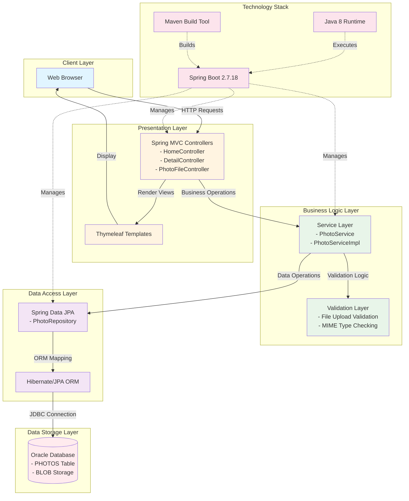

# PhotoAlbum-Java Architecture Diagram

This diagram represents the high-level architecture of the PhotoAlbum-Java application based on the assessment results.

## Application Architecture

## Key Components

### Presentation Layer
- **Thymeleaf Templates**: Server-side rendering engine for HTML views
- **Spring MVC Controllers**: Handle HTTP requests and coordinate application flow
  - HomeController: Gallery view and photo listing
  - DetailController: Individual photo details with navigation
  - PhotoFileController: Photo upload and file operations

### Business Logic Layer
- **PhotoService**: Core business logic for photo management
  - Photo upload processing
  - Photo retrieval and metadata
  - Photo deletion
- **Validation**: File upload validation (type, size, MIME checking)

### Data Access Layer
- **Spring Data JPA**: Repository pattern for data access
- **Hibernate ORM**: Object-relational mapping framework
- **PhotoRepository**: JPA repository for Photo entity operations

### Data Storage
- **Oracle Database**: Persistent storage using Oracle Database Free
  - PHOTOS table with BLOB storage for photo data
  - Metadata storage (filename, size, dimensions, MIME type)
  - UUID-based primary keys

### Technology Stack
- **Framework**: Spring Boot 2.7.18
- **Language**: Java 8
- **Build Tool**: Maven
- **ORM**: Hibernate/JPA
- **Database Driver**: Oracle JDBC (ojdbc8)
- **Templating**: Thymeleaf
- **Frontend**: Bootstrap 5.3.0

## Data Flow

1. **Upload Flow**:
   - User uploads photo via web browser
   - PhotoFileController receives multipart file
   - Validation layer checks file type and size
   - PhotoService processes and stores photo
   - PhotoRepository persists photo data as BLOB in Oracle DB

2. **Gallery View Flow**:
   - HomeController fetches all photos
   - PhotoService retrieves photo metadata from database
   - Thymeleaf renders gallery grid view
   - Browser displays responsive photo gallery

3. **Detail View Flow**:
   - DetailController fetches specific photo by ID
   - PhotoService retrieves full photo data and metadata
   - Thymeleaf renders detail view with navigation
   - Browser displays full-size photo with metadata

## External Dependencies

- **Oracle Database**: Primary data storage (containerized with Docker)
- **Bootstrap 5**: Frontend CSS framework (CDN)
- **Commons IO**: File operation utilities
- **Spring Boot DevTools**: Development-time support

## Deployment Architecture

The application is containerized using Docker Compose:
- **photoalbum-java-app**: Spring Boot application container
- **oracle-db**: Oracle Database Free container
- **Networks**: Bridge network for container communication
- **Volumes**: Persistent storage for Oracle data

## Migration Considerations

Based on the assessment, key areas for Azure migration:
- Replace Oracle Database with Azure Database services (Azure SQL, PostgreSQL, or Cosmos DB)
- Migrate BLOB storage to Azure Blob Storage for scalability
- Deploy application to Azure App Service, Azure Container Apps, or AKS
- Implement Azure-native authentication and authorization
- Consider upgrading to Java 21 LTS and Spring Boot 3.x for better Azure integration
