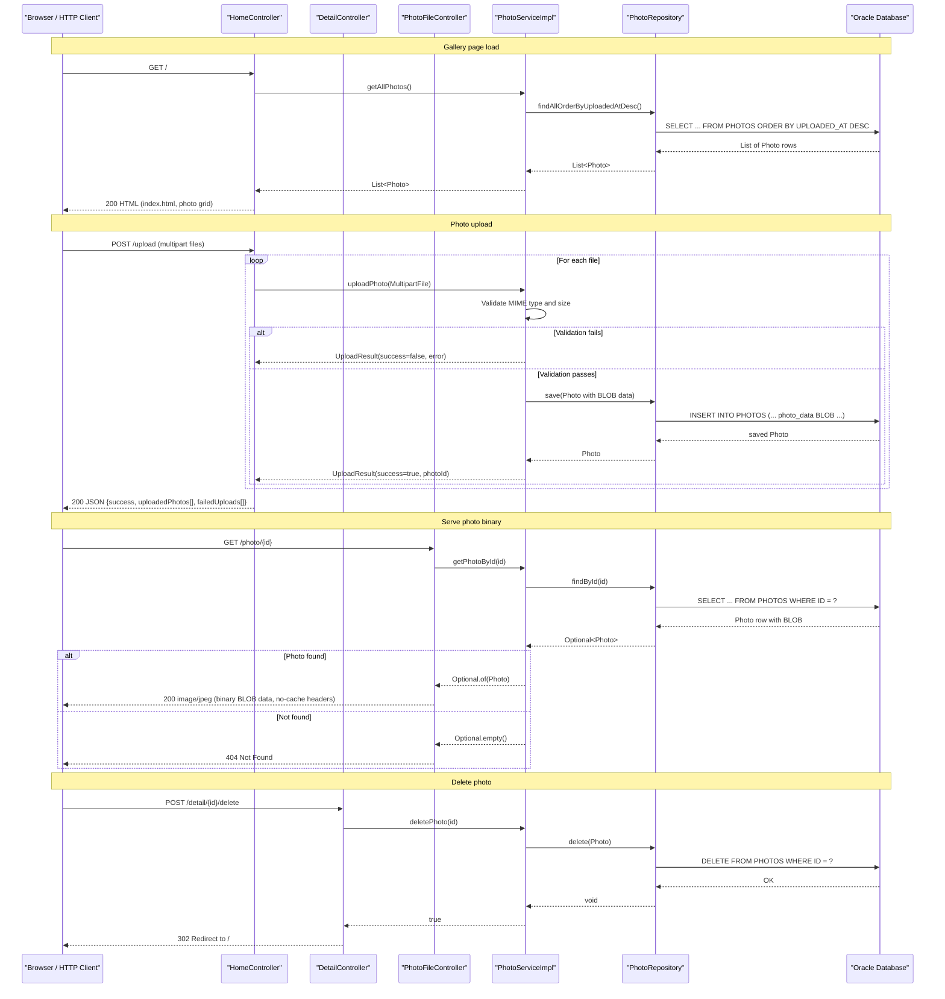

# API & Service Communication Contracts

PhotoAlbum-Java exposes **5 HTTP endpoints** across three Spring MVC controllers; all communication is synchronous REST over HTTP with no API gateway, message broker, or external service integrations.

## Service Catalog

| Service | Port | Category | Purpose |
|---------|------|----------|---------|
| photoalbum-java-app | 8080 | Business | Spring Boot web application serving the photo gallery UI and REST upload API |
| oracle-db | 1521 | Infrastructure | Oracle Database Free (third-party container) providing persistent BLOB and metadata storage |

## API Endpoints Inventory

| Service | Method | Path | Request Type | Response Type |
|---------|--------|------|-------------|--------------|
| HomeController | GET | `/` | — | HTML view (`index.html`) with `List<Photo>` model |
| HomeController | POST | `/upload` | `multipart/form-data` — `files` param (`List<MultipartFile>`) | JSON `200 OK` — `{success, uploadedPhotos[], failedUploads[]}` or `400 Bad Request` |
| DetailController | GET | `/detail/{id}` | Path param `id` (String UUID) | HTML view (`detail.html`) with `Photo` model + nav IDs; redirects to `/` on not-found |
| DetailController | POST | `/detail/{id}/delete` | Path param `id` (String UUID) | Redirect `302` to `/` with flash attributes |
| PhotoFileController | GET | `/photo/{id}` | Path param `id` (String UUID) | Binary image response (`image/jpeg`, `image/png`, etc.) with `Cache-Control: no-store` headers; `404` if not found |

## Management & Observability Endpoints

| Service | Endpoint | Custom Metrics |
|---------|----------|---------------|
| photoalbum-java-app | None — Spring Boot Actuator is not on the classpath | None declared |

No `/actuator/health`, `/actuator/metrics`, or `/actuator/prometheus` endpoints are available. There are no `@Timed` or custom Micrometer metric registrations in the codebase.

## DTOs & Contracts

**Service-level domain classes used in the API:**

- **`Photo`** (JPA Entity / response model): Returned directly from service layer to controllers and rendered in Thymeleaf templates or serialized to JSON in the upload response. Not immutable — uses standard mutable POJO with getters/setters. Full field details are in `data-architecture.md`.
- **`UploadResult`** (response DTO): Carries the outcome of a single-file upload operation: `success` (boolean), `fileName` (String), `photoId` (String UUID on success), and `errorMessage` (String on failure). Mutable POJO; provides a `failure(...)` static factory method. Consumed by `HomeController` to build the JSON upload response.

No OpenAPI/Swagger specification, protobuf schemas, or GraphQL schemas are present. Jackson (via `spring-boot-starter-json`) handles JSON serialization for the upload response endpoint using default settings — no custom serializers or `ObjectMapper` configuration is declared.

## Communication Patterns

**Synchronous only.** All client-to-application communication is HTTP/1.1 REST. The application makes no outbound HTTP calls to other services; all downstream communication is via JDBC to Oracle.

**Resilience:** No circuit breaker, retry policy, bulkhead, or timeout configuration is declared (no Resilience4j, Spring Retry, or equivalent). Failed database operations propagate as unchecked `RuntimeException` to the controller, which returns a `500` response or redirects to the home page.

**Service discovery:** Not applicable — single-service deployment. The Oracle JDBC URL is hardcoded in `application.properties` (default profile) and overridden via environment variable `SPRING_DATASOURCE_URL` in the Docker profile.

**Startup dependency chain:** The `docker-compose.yml` configures `photoalbum-java-app` to wait for `oracle-db` to pass its health check (`condition: service_healthy`) before starting. No application-level readiness probe is registered. For full Docker configuration details see `configuration-inventory.md`.

**Security posture:** No authentication, authorization, or TLS is configured. Spring Security is not on the classpath. All five endpoints — including photo deletion (`POST /detail/{id}/delete`) and file upload (`POST /upload`) — are publicly accessible with no authorization checks. There is no CSRF protection and no HTTPS configuration.

## Service Technology Matrix

| Service | Web Framework | Data Access | Discovery | Gateway | Actuator/Health | Cache | Metrics |
|---------|--------------|-------------|-----------|---------|----------------|-------|---------|
| photoalbum-java-app | Spring MVC (servlet) | Spring Data JPA + Hibernate 5.6 | None | None | None | None | None |
| oracle-db | N/A (third-party) | N/A | N/A | N/A | Docker healthcheck only | N/A | N/A |

## Service Communication Sequence

