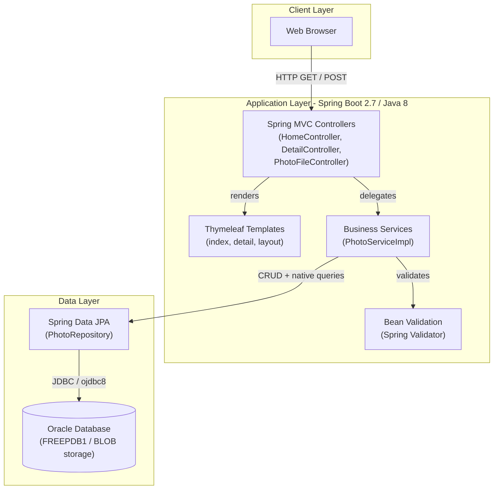
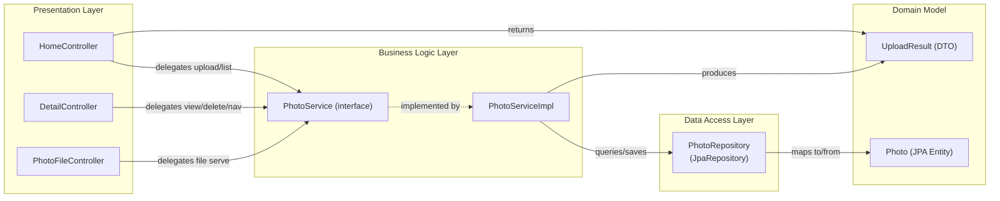

# Architecture Diagram

PhotoAlbum-Java is a Spring Boot 2.7 web application that allows users to upload, browse, and manage photos, storing image data as BLOBs in an Oracle database.

## Application Architecture

### Technology Stack Summary

| Layer | Technology | Version | Purpose |
|-------|-----------|---------|---------|
| Presentation | Spring MVC + Thymeleaf | 2.7.18 / 3.x | Server-side rendering and REST endpoints |
| Business Logic | Spring Boot Service | 2.7.18 | Photo upload, retrieval, deletion, navigation |
| Data Access | Spring Data JPA / Hibernate | 2.7.18 | ORM and query abstraction |
| Database | Oracle Database (FREEPDB1) | Oracle XE / Free | Persistent storage for photo metadata and BLOBs |
| Runtime | Java | 8 | Application runtime |
| Build | Apache Maven | 3.x | Dependency management and build |
| Testing | JUnit 5 + H2 | Spring Boot 2.7.18 | Unit and integration tests |

### Data Storage & External Services

Photos and their metadata (filename, MIME type, dimensions, upload timestamp) are stored entirely within an Oracle Database instance. The binary image content is persisted as a `BLOB` (`byte[]` mapped via `@Lob`) in the `photos` table, eliminating the need for a file system or external object store. The application connects to Oracle via the `ojdbc8` JDBC driver using a fixed data source configured in `application.properties`. No external caches, message brokers, or third-party APIs are used; all data flows are internal between the Spring Boot process and the Oracle instance.

### Key Architectural Decisions

- **BLOB storage in Oracle**: Images are stored directly in the database as byte arrays rather than on disk or in cloud object storage, simplifying deployment but coupling the app tightly to Oracle.
- **Native SQL queries for Oracle-specific features**: The `PhotoRepository` uses Oracle-specific functions (`ROWNUM`, `TO_CHAR`, `NVL`, analytical `RANK() OVER`) in native queries to implement pagination, filtering, and ranking.
- **Constructor injection + `@Transactional` service**: `PhotoServiceImpl` receives all dependencies via constructor and is annotated `@Transactional`, following standard Spring best practices for testability and transaction management.

## Component Relationships

### Component Inventory

| Component | Layer | Type | Responsibility |
|-----------|-------|------|---------------|
| HomeController | Presentation | Spring MVC Controller | Handles GET `/` (gallery list) and POST `/upload` (multi-file upload); returns HTML view or JSON |
| DetailController | Presentation | Spring MVC Controller | Handles GET `/detail/{id}` (single photo view) and POST `/detail/{id}/delete` (photo deletion) |
| PhotoFileController | Presentation | Spring MVC Controller | Handles GET `/photo/{id}` to stream BLOB photo data with appropriate `Content-Type` headers |
| PhotoService | Business Logic | Service Interface | Defines contract for all photo operations (list, get, upload, delete, navigation) |
| PhotoServiceImpl | Business Logic | Service Implementation | Validates files (MIME type, size), reads bytes, extracts dimensions via `ImageIO`, persists via repository |
| PhotoRepository | Data Access | Spring Data JPA Repository | Extends `JpaRepository`; provides CRUD plus Oracle-specific native queries for ordering, pagination, and statistics |
| Photo | Domain Model | JPA Entity | Maps to `photos` table; holds metadata and `@Lob` binary image data |
| UploadResult | Domain Model | DTO | Carries upload outcome (success flag, photo ID or error message) between service and controller |
| MathUtil | Utility | Utility Class | General-purpose math helper utilities |
