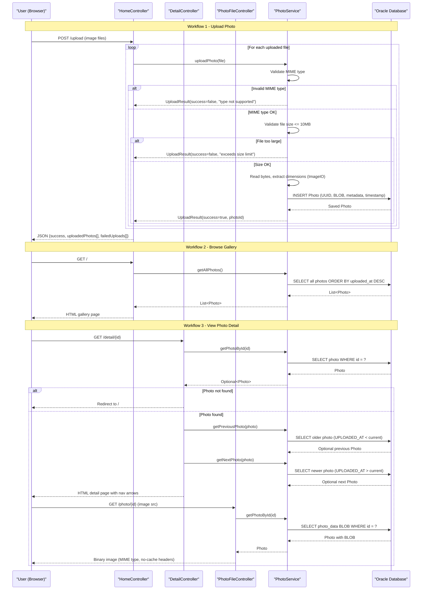

# Core Business Workflows

PhotoAlbum-Java is a personal photo gallery application that lets users upload, browse, view, and delete images stored in a central database.

## Domain Entities

| Entity | Service / Bounded Context | Description | Key Relationships |
|--------|--------------------------|-------------|------------------|
| Photo | Photo Management (single bounded context) | Represents an uploaded image with its binary content and descriptive metadata (name, size, MIME type, dimensions, upload timestamp) | Self-referential temporal ordering: photos are navigated sequentially by `uploadedAt` timestamp (previous / next) |

## Service-to-Domain Mapping

| Service | Domain Context | Owned Entities | External Dependencies |
|---------|---------------|---------------|----------------------|
| photoalbum-java-app | Photo Management | `Photo` | Oracle Database (persistence of metadata + BLOB image data) |

This is a single-service, single-context application. There are no inter-service dependencies, event buses, or remote API calls to external services.

## Primary Workflows

### Workflow 1: Photo Upload

A user selects one or more image files in the browser gallery and submits them. The application validates each file, extracts image dimensions, stores the binary content in Oracle, and returns a structured JSON response indicating which uploads succeeded and which failed.

**Steps:**
1. User submits a multipart POST request with one or more image files.
2. Controller iterates over each `MultipartFile` and calls `PhotoService.uploadPhoto()`.
3. Service validates the file's MIME type against the configured allow-list (`image/jpeg`, `image/png`, `image/gif`, `image/webp`).
4. Service validates the file size does not exceed the configured maximum (10 MB).
5. Service validates that the file is non-empty (size > 0).
6. Service reads all bytes from the multipart stream and attempts to extract pixel dimensions using `ImageIO.read()`.
7. Service constructs a `Photo` entity with a UUID primary key, binary data, metadata, and current timestamp; persists it to Oracle.
8. Service returns an `UploadResult(success=true, photoId=<UUID>)` to the controller.
9. Controller aggregates all individual results into a JSON response: `{success, uploadedPhotos[], failedUploads[]}`.

**Business rules involved:** File type validation, file size limit, empty file rejection, image dimension extraction (best-effort; non-critical failure is tolerated).

---

### Workflow 2: Gallery Browse

A user loads the home page to see all uploaded photos in reverse-chronological order.

**Steps:**
1. User sends a GET request to `/`.
2. Controller calls `PhotoService.getAllPhotos()`.
3. Service queries Oracle for all photos ordered by `uploadedAt DESC` (native SQL).
4. Controller passes the photo list to the Thymeleaf `index.html` template.
5. Template renders a thumbnail grid; each thumbnail references `/photo/{id}` for the image binary.

---

### Workflow 3: View Photo Detail with Navigation

A user clicks a photo to view it full-size with previous/next navigation.

**Steps:**
1. User sends a GET request to `/detail/{id}`.
2. Controller calls `PhotoService.getPhotoById(id)`; redirects to `/` if not found.
3. Controller calls `PhotoService.getPreviousPhoto(photo)` — queries Oracle for the most recent photo uploaded before the current one.
4. Controller calls `PhotoService.getNextPhoto(photo)` — queries Oracle for the oldest photo uploaded after the current one.
5. Controller passes `photo`, `previousPhotoId`, and `nextPhotoId` to the `detail.html` template.
6. Template renders the full-size image (referencing `/photo/{id}`) and navigation arrows.

---

### Workflow 4: Serve Photo Binary

The browser fetches the actual image bytes for rendering thumbnails and full-size views.

**Steps:**
1. Browser sends a GET request to `/photo/{id}` (triggered by an `` tag).
2. Controller calls `PhotoService.getPhotoById(id)`; returns `404` if not found.
3. Controller reads the `photoData` byte array from the `Photo` entity.
4. Controller returns the binary BLOB with the stored MIME type and `Cache-Control: no-cache, no-store` headers.

---

### Workflow 5: Delete Photo

A user deletes a photo from the detail page.

**Steps:**
1. User submits a POST request to `/detail/{id}/delete`.
2. Controller calls `PhotoService.deletePhoto(id)`.
3. Service looks up the photo by ID; returns `false` (not found) if absent.
4. Service calls `PhotoRepository.delete(photo)`, removing the row (and BLOB) from Oracle.
5. Controller sets a flash attribute (`successMessage` or `errorMessage`) and redirects to `/`.

## Cross-Service Data Flows

PhotoAlbum-Java is a monolithic single-service application. All data originates from and returns to a single Oracle database schema. There are no inter-service REST calls, event-driven integrations, or data aggregation across multiple upstream services.

The only data composition that occurs is within the detail-view workflow, where the service makes three sequential queries (fetch current photo, fetch previous photo, fetch next photo) and the controller assembles the navigation context before rendering the template. This is intra-service composition, not cross-service.

No circuit-breaker fallback paths apply — if Oracle is unavailable, all workflows fail with a runtime exception; there is no degraded-mode behavior implemented.

## Business Workflow Sequence



## Business Rules & Decision Logic

### Validation Rules

| Rule | Applies To | Behavior on Violation |
|------|-----------|----------------------|
| Allowed MIME types: `image/jpeg`, `image/png`, `image/gif`, `image/webp` | Upload | Returns `UploadResult(success=false)` with "File type not supported" message; upload for that file is skipped |
| Max file size: 10,485,760 bytes (10 MB) | Upload | Returns `UploadResult(success=false)` with "File size exceeds XMB limit" message |
| Non-empty file (size > 0) | Upload | Returns `UploadResult(success=false)` with "File is empty" message |
| Non-null, non-blank photo ID | Detail view, file serve, delete | Redirects to `/` (detail/delete) or returns `404` (file serve) |
| Maximum files per upload: 10 | Upload (multipart config) | Enforced at HTTP layer by Spring multipart `max-request-size=50MB`; no explicit business-layer enforcement of the `max-files-per-upload=10` property |

### Decision Logic

- **Batch upload result aggregation**: A POST `/upload` request with multiple files is processed file-by-file. Individual failures do not abort the entire batch; `success` in the response is `true` if at least one file uploaded successfully.
- **Image dimensions (best-effort)**: `ImageIO.read()` is attempted to extract pixel width/height. If it returns `null` or throws, the photo is still persisted without dimensions — dimension extraction failure is non-fatal.
- **Navigation boundary**: `getPreviousPhoto` and `getNextPhoto` return `Optional.empty()` when no older/newer photo exists; the template hides the corresponding navigation arrow.

### State Transitions

`Photo` has a simple two-state lifecycle:

```
[Uploaded / Persisted]  →  (user deletes)  →  [Deleted / Removed]
```

There are no intermediate states (draft, pending, approved). Once saved, a photo is immediately visible in the gallery.

### Transaction Boundaries

- `PhotoServiceImpl` is annotated `@Transactional` at the class level — all public methods participate in a transaction by default.
- Read operations (`getAllPhotos`, `getPhotoById`, `getPreviousPhoto`, `getNextPhoto`) are overridden with `@Transactional(readOnly = true)` to allow Hibernate optimizations.
- Each upload call (`uploadPhoto`) runs in its own transaction — a failure for one file does not roll back uploads that already completed.

### Error Handling

- All service-layer exceptions are caught in the controller and either result in a redirect to `/` (with flash error message) or a JSON `failedUploads` entry. No custom business exception types are defined.
- Unexpected exceptions in `getAllPhotos` cause the gallery to render with an empty list rather than a 500 error page.
- `deletePhoto` throws `RuntimeException` on unexpected errors, which surfaces as a 500 if uncaught by the controller.

### Authorization

No authentication or authorization is implemented. All workflows are available to any anonymous HTTP client. See `api-service-contracts.md` for security posture details.

### Audit / Logging

Business operations are logged at DEBUG level (INFO in Docker) using SLF4J. Notable log events: successful upload with photo ID, upload rejection with reason, deletion confirmation. There is no formal audit trail, change-event log, or external audit sink.
