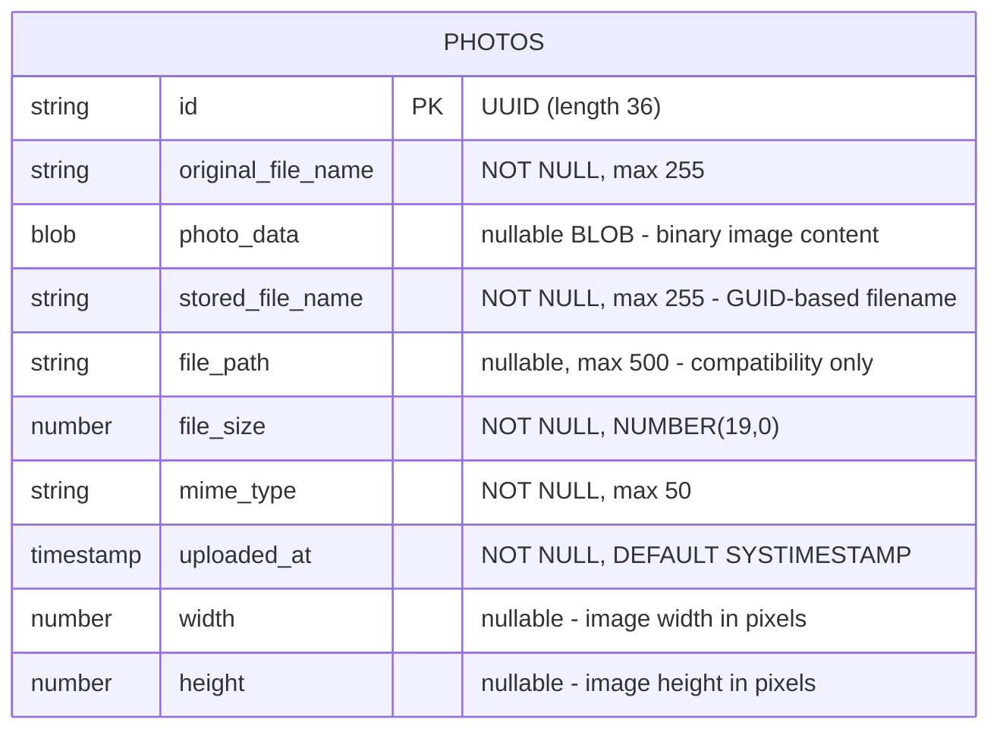

# Data Architecture & Persistence Layer

PhotoAlbum-Java has a single JPA entity (`Photo`) persisted in Oracle Database using Hibernate 5.6 via Spring Data JPA, storing image binary content as a BLOB column alongside metadata fields.

## Database Configuration

| Service/Module | DB Type | Profile | Driver | Connection | Migration Tool |
|---------------|---------|---------|--------|-----------|---------------|
| photoalbum-java-app | Oracle Database Free (FREEPDB1) | default (local) | ojdbc8 (Oracle JDBC) | `jdbc:oracle:thin:@oracle-db:1521/FREEPDB1` | None — Hibernate `ddl-auto=create` recreates schema on startup |
| photoalbum-java-app | Oracle Database Free (XE) | docker | ojdbc8 (Oracle JDBC) | `jdbc:oracle:thin:@oracle-db:1521:XE` | None — Hibernate `ddl-auto=create` recreates schema on startup |
| photoalbum-java-app | H2 (in-memory) | test | H2 JDBC Driver | `jdbc:h2:mem:testdb` | None — Hibernate `ddl-auto=create-drop` manages test schema |

Schema management is handled entirely by Hibernate DDL auto-generation (`create` mode in runtime profiles, `create-drop` for tests). No Flyway or Liquibase migration tool is present; the `photos` table is dropped and recreated on every application startup, making this configuration unsuitable for production use without persistent data. The Oracle user (`photoalbum`) is provisioned by the init script `oracle-init/01-create-user.sql`, which is executed automatically when the Oracle container starts. No seed data files (`data.sql`, `import.sql`) are present. For full property key-value details see `configuration-inventory.md`.

## Data Ownership per Service

| Service | Tables Owned | ORM Framework | Caching | Notes |
|---------|-------------|--------------|---------|-------|
| photoalbum-java-app | `photos` | Hibernate 5.6 via Spring Data JPA | None | Single table stores all photo metadata and BLOB data; schema auto-generated by Hibernate on startup |

## Entity Model

**Entity notes:**
- `Photo` is annotated `@Entity @Table(name = "photos")` with a composite index on `uploaded_at` (`idx_photos_uploaded_at`).
- The primary key `id` is a UUID string assigned in the default constructor (`UUID.randomUUID().toString()`); no `@GeneratedValue` strategy is used.
- `photoData` is mapped with `@Lob` as a `byte[]`, storing the full binary image directly in Oracle.
- `@Transactional` is applied at the `PhotoServiceImpl` class level; read-only methods override with `@Transactional(readOnly = true)`.

## Key Repository Methods

| Repository | Return Type | Method Signature | Purpose |
|-----------|-------------|-----------------|---------|
| PhotoRepository | `List<Photo>` | `findAllOrderByUploadedAtDesc()` | Lists all photos newest-first for the gallery home page (native Oracle SQL) |
| PhotoRepository | `Optional<Photo>` | `findById(String id)` (inherited) | Fetches a single photo by UUID for detail view and file serving |
| PhotoRepository | `List<Photo>` | `findPhotosUploadedBefore(LocalDateTime uploadedAt)` | Returns up to 10 photos older than the given timestamp for backward navigation (uses Oracle `ROWNUM`) |
| PhotoRepository | `List<Photo>` | `findPhotosUploadedAfter(LocalDateTime uploadedAt)` | Returns photos newer than the given timestamp for forward navigation |
| PhotoRepository | `List<Photo>` | `findPhotosByUploadMonth(String year, String month)` | Filters photos by year/month using Oracle `TO_CHAR` — declared but not currently called from any controller |
| PhotoRepository | `List<Photo>` | `findPhotosWithPagination(int startRow, int endRow)` | Oracle `ROWNUM`-based pagination — declared but not currently called from any controller |
| PhotoRepository | `List<Object[]>` | `findPhotosWithStatistics()` | Returns photos with `RANK() OVER` and running `SUM` analytical functions — declared but not currently called |
| PhotoRepository | `void` | `delete(Photo)` (inherited) | Removes a photo record (and its BLOB) from the database |
| PhotoRepository | `Photo` | `save(Photo)` (inherited) | Inserts or updates a photo record |

All custom methods use `@Query(nativeQuery = true)` with Oracle-specific SQL. Source file: `src/main/java/com/photoalbum/repository/PhotoRepository.java`.

## Caching Strategy

No caching layer is configured. There are no `@Cacheable`, `@CacheEvict`, or `@CachePut` annotations, no cache provider (EhCache, Redis, Caffeine) on the classpath, and no Hibernate second-level cache configuration. Every HTTP request to the gallery home page (`GET /`) triggers a full `SELECT ... FROM PHOTOS ORDER BY UPLOADED_AT DESC` query against Oracle, and every `GET /photo/{id}` retrieves the full BLOB from the database. The `PhotoFileController` sets aggressive `Cache-Control: no-cache, no-store` response headers, which also prevents browser-side caching of image binaries.

## Data Ownership Boundaries

**Single-service, single-database topology.** There is only one deployable application service and one database. All data is owned by `photoalbum-java-app` in a single Oracle schema (`photoalbum` user). There are no cross-service data access patterns, shared databases, or inter-service queries.

**Read/write pattern:** All reads and writes go through `PhotoRepository` (Spring Data JPA backed by Hibernate). There is no CQRS separation, read replica, or event sourcing; the same Oracle instance handles both queries and mutations.

**Schema management risk:** Hibernate `ddl-auto=create` drops and recreates the `photos` table (including all BLOB data) on every application restart in both the default and Docker profiles. This is a critical data-loss risk in any environment where photos are expected to persist across restarts.

### Data Classification & Sensitivity

| Entity | Sensitive Fields | Classification | Controls in Place |
|--------|----------------|---------------|-------------------|
| Photo | `original_file_name` (user-provided filename), `photo_data` (image BLOB — may contain EXIF metadata including GPS coordinates, device identifiers) | Potentially PII (EXIF data embedded in images) | None — no encryption-at-rest, no EXIF stripping, no field-level access control, no masking |

The `photos` table does not store explicit PII such as usernames, email addresses, or personal identifiers. However, uploaded image files may contain EXIF metadata (GPS location, device serial number, timestamps) embedded in the binary data, which constitutes PII under GDPR. The application reads image bytes directly via `ImageIO` to extract pixel dimensions but does not strip EXIF data before persisting the BLOB. No encryption-at-rest is configured for the Oracle tablespace, and there is no authentication layer protecting access to stored images.
