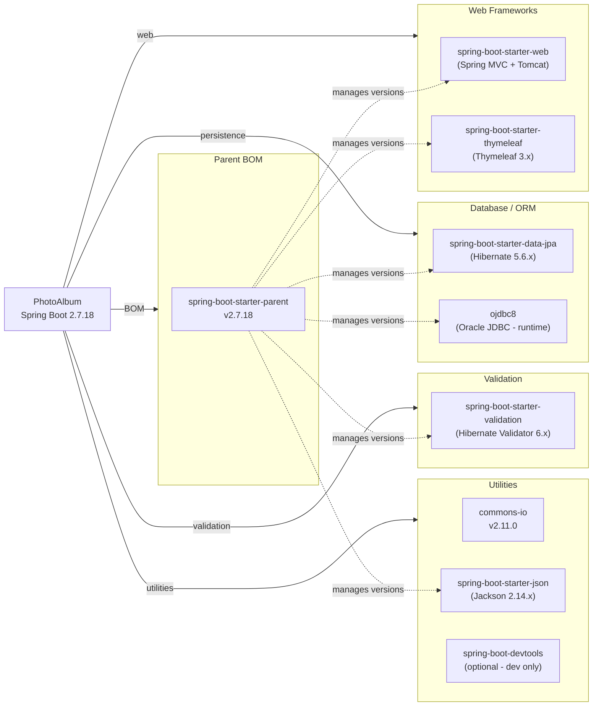

# Dependency Map

PhotoAlbum-Java declares **10 dependencies** (8 production + 2 test-scoped) managed via Maven with the Spring Boot 2.7.18 parent BOM.

## Dependencies

### Dependency Summary

| Category | Count | Key Libraries | Notes |
|----------|-------|--------------|-------|
| Web Frameworks | 2 | Spring MVC (via spring-boot-starter-web), Thymeleaf 3.x | Legacy Spring Boot 2.x stack; Spring Boot 2.7.x reaches end-of-life Aug 2023 |
| Database / ORM | 2 | Hibernate 5.6.x (via JPA starter), ojdbc8 (Oracle JDBC) | Oracle-specific dialect and native queries throughout; tightly coupled to Oracle |
| Validation | 1 | Hibernate Validator 6.x (via validation starter) | Jakarta EE 8 / `javax.validation` namespace — must migrate to `jakarta.validation` for Spring Boot 3 |
| Utilities | 3 | commons-io 2.11.0, Jackson 2.14.x, spring-boot-devtools | commons-io 2.11.0 is stable; devtools is optional/dev-only |

### Version & Compatibility Risks

Spring Boot 2.7.18 is the final 2.x release and reached **commercial end-of-life in August 2023** (OSS support ended February 2023). Migrating to Spring Boot 3.x requires upgrading the Java baseline to **Java 17** (from the current Java 8) and switching all `javax.*` imports to the `jakarta.*` namespace (EE 9+). Hibernate 5.6.x is also end-of-life; Spring Boot 3 bundles Hibernate 6, which has breaking API changes. The Oracle JDBC driver (`ojdbc8`) must be kept in sync with the Oracle server version; however the dependency version is managed by the Spring Boot BOM rather than declared explicitly, which may lag behind the latest certified driver. Commons IO 2.11.0 has no known CVEs but a newer 2.15.x line is available.

### Notable Observations

- **Java 8 baseline**: The application targets Java 8 (`maven.compiler.source=8`), which is significantly behind the current Java LTS (Java 21). Any migration to Spring Boot 3 mandates a minimum of Java 17; this represents a substantial upgrade effort.
- **Oracle vendor lock-in**: The use of `ojdbc8`, Oracle-specific SQL (`ROWNUM`, `TO_CHAR`, `NVL`, `RANK() OVER`), and `OracleDialect` makes the data layer non-portable. Migrating to a managed cloud database (e.g., Azure Database for PostgreSQL) would require rewriting all native queries.
- **No caching or messaging libraries**: The application has no declared caching (e.g., Redis/EhCache) or messaging (e.g., Kafka/Service Bus) dependencies. All photo data is fetched directly from Oracle on every request, which may become a performance bottleneck at scale.
- **No security framework**: There is no Spring Security or equivalent dependency declared. The application has no authentication or authorization layer, meaning all endpoints are publicly accessible.

## Test Dependencies

| Framework | Version | Notes |
|-----------|---------|-------|
| spring-boot-starter-test | 2.7.18 (managed) | Bundles JUnit 5 (Jupiter), Mockito, AssertJ, Spring Test |
| H2 Database | 2.x (managed by BOM) | In-memory database used as Oracle substitute in tests |

Total test-scope dependencies: **2**

The test setup relies on H2 as a stand-in for Oracle, which may hide Oracle-specific query incompatibilities (native SQL using `ROWNUM`, `TO_CHAR`, Oracle analytical functions) during unit testing. No integration testing framework (e.g., Testcontainers with an Oracle image) is present, meaning Oracle-specific code paths are not exercised in CI.
