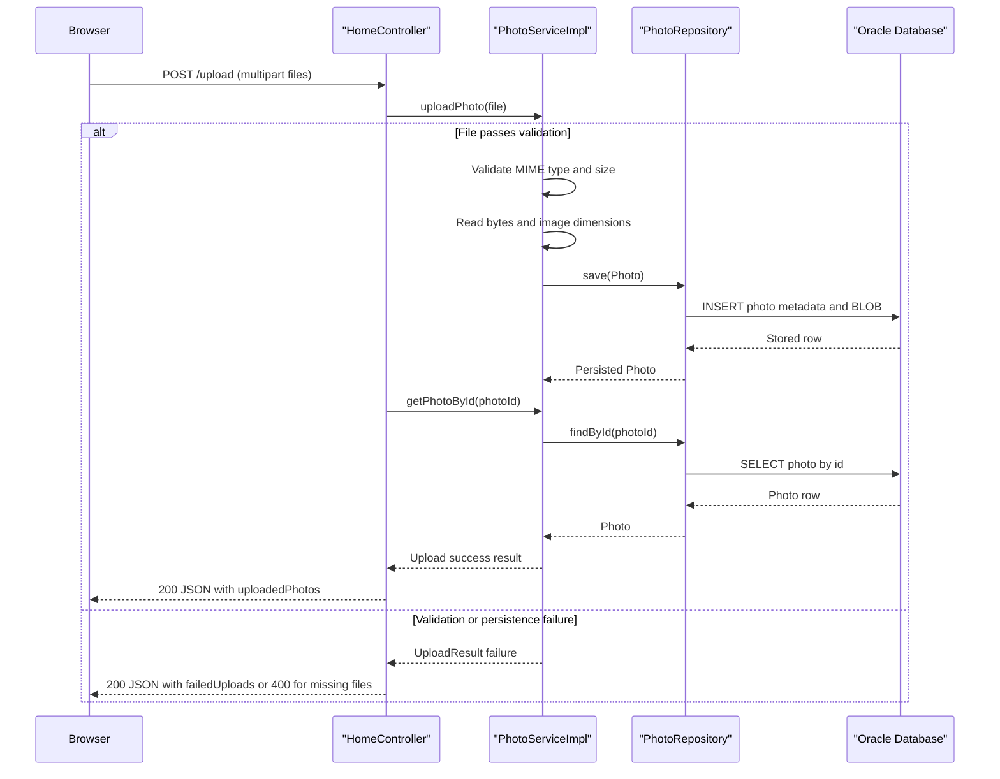

# API & Service Communication Contracts

The application exposes a small HTTP surface made up of one gallery page, one upload endpoint, one image streaming endpoint, and detail/delete routes for individual photos. Communication is entirely synchronous: browser requests are handled by Spring MVC controllers, which call a local service and persist to Oracle through JPA.

## Service Catalog

| Service | Port | Category | Purpose |
|---|---:|---|---|
| `photoalbum-java-app` | 8080 | API Layer | Serves gallery/detail pages, accepts uploads, streams photo content, and deletes photos |
| `oracle-db` | 1521 | Infrastructure | Stores photo metadata and image BLOB data for the web application |

## API Endpoints Inventory

| Service | Method | Path | Request Type | Response Type |
|---|---|---|---|---|
| `photoalbum-java-app` | GET | `/` | None | Thymeleaf `index.html` view with `photos` model data |
| `photoalbum-java-app` | POST | `/upload` | Multipart form field `files` containing one or more `MultipartFile` objects | JSON `Map<String,Object>` with `success`, `uploadedPhotos`, and `failedUploads` |
| `photoalbum-java-app` | GET | `/detail/{id}` | Path parameter `id:String` | Thymeleaf `detail.html` view or redirect to `/` when not found |
| `photoalbum-java-app` | POST | `/detail/{id}/delete` | Path parameter `id:String` | Redirect to `/` with flash success/error message |
| `photoalbum-java-app` | GET | `/photo/{id}` | Path parameter `id:String` | `ResponseEntity<Resource>` image stream with 200, 404, or 500 status |

## Management & Observability Endpoints

| Service | Endpoint | Custom Metrics |
|---|---|---|
| `photoalbum-java-app` | None detected | No Actuator, health, metrics, or Swagger endpoints detected |

## DTOs & Contracts

The application does not define dedicated request DTO classes for its HTTP surface. Upload requests are accepted as Spring `MultipartFile` collections, while server-rendered views bind directly to the `Photo` domain entity for display purposes. The only explicit contract helper class is `UploadResult`, which is used internally by the service layer to communicate per-file outcomes before the controller converts those results into an ad hoc JSON map.

No gateway-level aggregation DTOs, OpenAPI specifications, protobuf schemas, or GraphQL schemas were found. JSON serialization relies on Spring Boot's default Jackson configuration through `spring-boot-starter-json`.

## Communication Patterns

All communication is synchronous. Browser clients call Spring MVC controllers over HTTP, controllers invoke `PhotoServiceImpl` through direct in-process method calls, and the service uses `PhotoRepository` for synchronous Oracle database access. No asynchronous messaging, background workers, service discovery, API gateway, client-side load balancing, retry policy, circuit breaker, or timeout library was detected.

API availability depends on the Oracle database container being healthy before the web container starts; Docker Compose enforces this startup dependency with `depends_on` and a database health check. Security posture is minimal: no TLS termination, authentication, authorization rules, or Spring Security configuration were found, so all endpoints are publicly accessible within the deployment environment.

## Service Technology Matrix

| Service | Web | Data Access | Discovery | Gateway | Actuator | Cache | Metrics |
|---|---|---|---|---|---|---|---|
| `photoalbum-java-app` | Spring MVC + Thymeleaf | Spring Data JPA / Hibernate | None | None | None | None | None |
| `oracle-db` | N/A | Oracle database engine | None | None | Health check only | N/A | None |

## Service Communication Sequence

