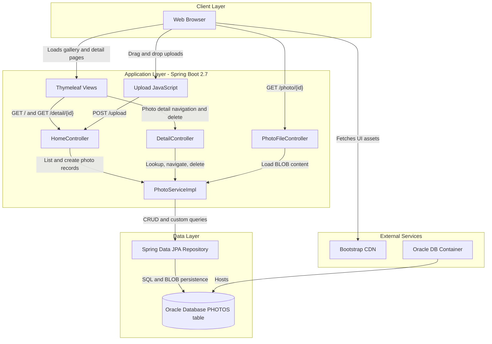
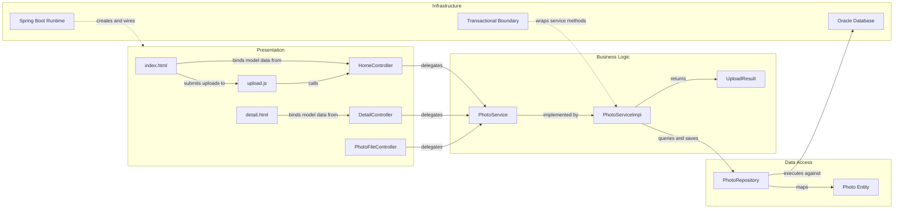

# Architecture Diagram

This document summarizes the Photo Album application's runtime structure and the main component relationships that support photo upload, gallery browsing, image retrieval, and deletion.

## Application Architecture

### Technology Stack Summary

| Layer | Technology | Version | Purpose |
|---|---|---|---|
| Presentation | Thymeleaf templates, Bootstrap, vanilla JavaScript | Thymeleaf via Spring Boot 2.7.18, Bootstrap 5.3.0 | Renders gallery/detail pages and handles drag-and-drop uploads |
| Web | Spring Boot Web, Spring MVC | 2.7.18 | Handles HTTP requests and server-side page composition |
| Business Logic | PhotoServiceImpl | Application code | Validates uploads, extracts metadata, coordinates persistence |
| Data Access | Spring Data JPA, Hibernate | Spring Boot managed | Maps the Photo entity to Oracle and executes repository queries |
| Storage | Oracle Database Free/XE | Container image latest / XE-compatible JDBC URL | Stores photo metadata and image BLOB data |
| Delivery | Docker, Docker Compose | Dockerfile + compose | Runs the web app and Oracle database as containers |

### Data Storage & External Services

The application stores all photo metadata and binary image content in a single Oracle database table named `PHOTOS`. Beyond the database, the only notable external dependency at runtime is the Bootstrap CDN used by the server-rendered UI for styling and client-side bundle delivery.

### Key Architectural Decisions

- Uses a classic layered Spring MVC design where controllers delegate all business logic and persistence orchestration to a single `PhotoServiceImpl` service.
- Persists uploaded images as Oracle BLOB data instead of filesystem storage, which keeps the application stateless from a file-hosting perspective.
- Uses server-rendered Thymeleaf pages for navigation while enhancing uploads with client-side JavaScript for drag-and-drop and immediate gallery updates.

## Component Relationships

### Component Inventory

| Component | Layer | Type | Responsibility |
|---|---|---|---|
| `index.html` | Presentation | Thymeleaf template | Displays the gallery, upload area, and flash/error messages |
| `detail.html` | Presentation | Thymeleaf template | Shows a single photo, metadata, navigation, and delete action |
| `upload.js` | Presentation | Browser script | Validates dropped files, posts multipart uploads, and prepends new cards to the gallery |
| `HomeController` | Presentation | MVC controller | Handles gallery rendering and upload responses |
| `DetailController` | Presentation | MVC controller | Handles detail page rendering and delete operations |
| `PhotoFileController` | Presentation | MVC controller | Streams image bytes with cache-control headers |
| `PhotoServiceImpl` | Business Logic | Service | Applies upload rules, extracts image dimensions, and coordinates CRUD operations |
| `PhotoRepository` | Data Access | Spring Data repository | Executes Oracle-specific native SQL for ordered listing and navigation |
| `Photo` | Data Access | JPA entity | Represents persisted photo metadata and BLOB content |
