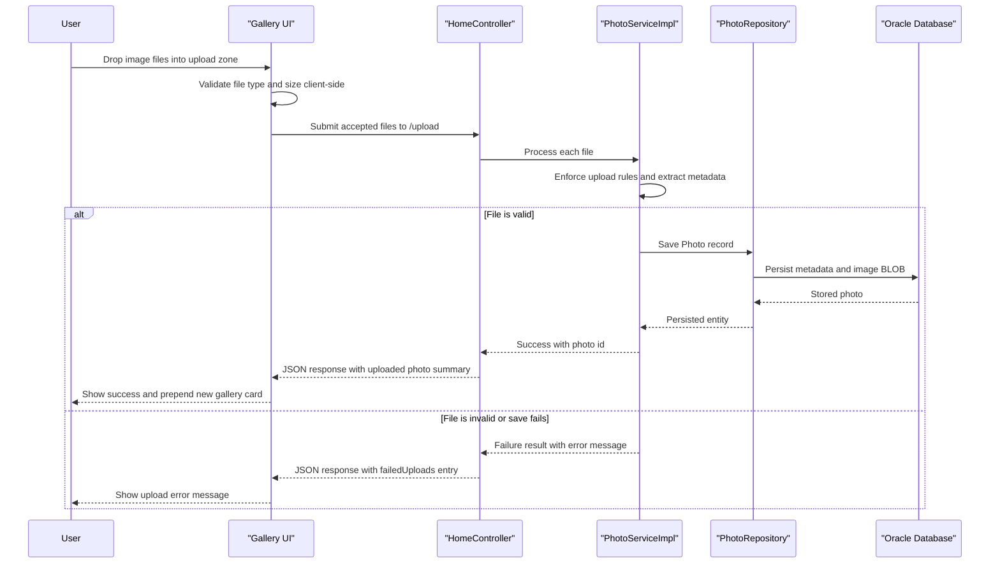

# Core Business Workflows

The Photo Album application supports a simple user journey: upload image files, browse the gallery, inspect photo details, and remove photos when no longer needed. Its business logic is concentrated around validating upload eligibility, preserving metadata, and presenting stored photos in a user-friendly order.

## Domain Entities

| Entity | Service / Bounded Context | Description | Key Relationships |
|---|---|---|---|
| `Photo` | Photo Management | Core business record representing a user-uploaded image plus its display metadata | Serves as the source of truth for gallery cards, detail views, navigation, and deletion |
| `UploadResult` | Photo Management | Transient workflow object describing whether an individual file upload succeeded or failed | Produced during upload processing and converted into the JSON response payload |

## Service-to-Domain Mapping

| Service | Domain Context | Owned Entities | External Dependencies |
|---|---|---|---|
| `photoalbum-java-app` | Photo Management | `Photo`, `UploadResult` | Oracle database for persistence; browser clients for UI-driven workflows |
| `oracle-db` | Persistence Infrastructure | Physical storage for `Photo` records | None beyond its role as the backing data store |

## Primary Workflows

### Workflow 1: Upload Photos

A user drags photos into the gallery page or selects them through the file picker. The browser script performs a first pass of MIME type and file size validation, then posts the accepted files to `/upload`. The service layer validates each file again, rejects unsupported or empty uploads, extracts image dimensions when possible, assigns a UUID-based stored filename for compatibility, saves the photo bytes and metadata, and returns a per-file success or failure outcome.

Business rules involved:
- Only JPEG, PNG, GIF, and WebP files are accepted.
- Each file must be non-empty and no larger than 10 MB.
- Upload success is reported per file so mixed-result batches can still partially succeed.
- Image dimension extraction is best-effort; failure to read dimensions does not block persistence.

### Workflow 2: Browse Gallery and View Photo Details

When a user opens `/`, the application retrieves all photos ordered by most recent upload time and renders them as gallery cards. Selecting a card opens `/detail/{id}`, where the application loads the chosen photo, computes previous/next navigation targets based on upload timestamps, and displays metadata such as file size, MIME type, and image dimensions.

Business rules involved:
- Gallery ordering is newest-first.
- Missing photo identifiers gracefully redirect the user back to the gallery.
- Previous and next navigation is derived from upload time, not filename or insertion order.

### Workflow 3: Delete a Photo

From the detail page, a user can submit the delete action for a specific photo. The service checks whether the record exists, removes it from the database when present, and redirects the user back to the gallery with a success or error flash message.

Business rules involved:
- Deletion only succeeds when the target photo exists.
- The UI always returns the user to the gallery after the operation.
- User confirmation is required in the browser before the delete form is submitted.

## Cross-Service Data Flows

There is no multi-service business composition layer in this application. Business data flows from the browser to the Spring Boot application and then to Oracle, with the same service acting as the source of truth for validation, persistence, and presentation. When failures occur, the application degrades in business-visible ways: upload batches return per-file error messages, missing detail records redirect to the gallery, and delete attempts surface a user-facing error message instead of throwing a visible exception.

## Business Workflow Sequence

## Business Rules & Decision Logic

- **Validation rules:** The application accepts only JPEG, PNG, GIF, and WebP uploads, enforces a 10 MB per-file limit, and rejects empty files.
- **Decision logic:** Upload processing follows a per-file success/failure model so one bad file does not block the entire batch.
- **Computed values:** The service derives image width and height from image bytes when available, and the UI computes human-readable file size displays and formatted upload timestamps.
- **State transitions:** A `Photo` record moves from not persisted to persisted on upload and from persisted to removed on delete; there are no intermediate approval states.
- **Transactions:** `PhotoServiceImpl` is annotated with `@Transactional`, so persistence operations run inside Spring-managed transaction boundaries.
- **Error handling and authorization:** The application logs operational failures and converts them into redirects or structured upload errors. No business-level authorization rules or role checks were detected.
