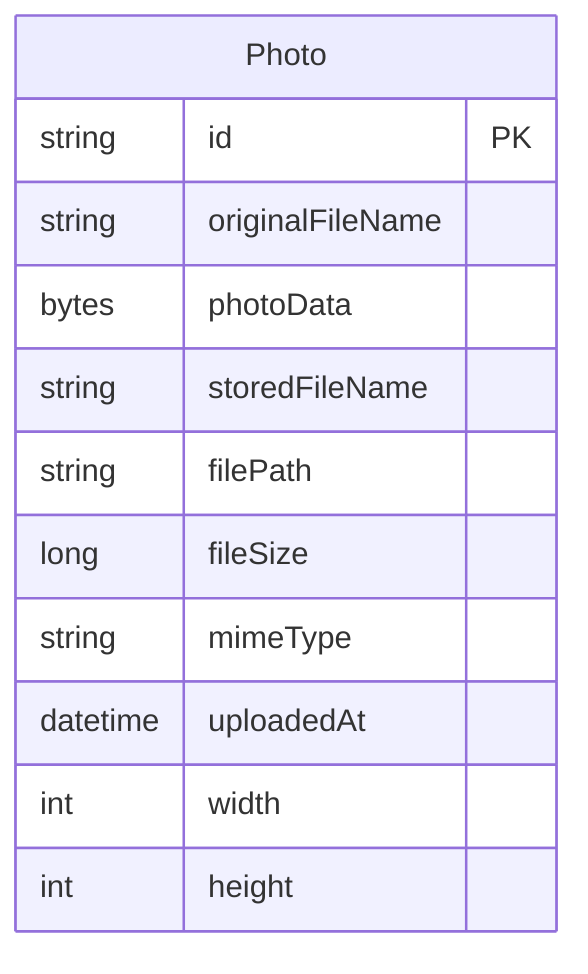

# Data Architecture & Persistence Layer

The data layer is intentionally small: a single JPA entity is stored in Oracle using Spring Data JPA and Hibernate. All persistence concerns are concentrated in one repository interface, with no caching layer or separate reporting store.

## Database Configuration

| Service/Module | DB Type | Profile | Driver | Connection | Migration Tool |
|---|---|---|---|---|---|
| `photoalbum-java-app` | Oracle Database | default | Oracle JDBC (`ojdbc8`) | JDBC URL points to `oracle-db:1521/FREEPDB1` | None; Hibernate creates schema at startup |
| `photoalbum-java-app` | Oracle Database XE | `docker` | Oracle JDBC (`ojdbc8`) | JDBC URL points to `oracle-db:1521:XE` | None; Hibernate creates schema at startup |
| `photoalbum-java-app` tests | H2 in-memory database | `test` | H2 | Spring Boot test auto-configuration with `@ActiveProfiles("test")` | None detected |

## Data Ownership per Service

| Service | Tables Owned | ORM Framework | Caching | Notes |
|---|---|---|---|---|
| `photoalbum-java-app` | `PHOTOS` | JPA / Hibernate via Spring Data JPA | None detected | Single-service ownership; stores both metadata and binary photo content |
| `oracle-db` | `PHOTOS` physical storage | Oracle engine | N/A | Backing store only; no independent domain ownership |

## Entity Model

The source entity model is defined in `src/main/java/com/photoalbum/model/Photo.java`. No JPA relationships to other entities were found; the model is a self-contained aggregate for photo content and metadata.

## Key Repository Methods

| Service | Repository | Notable Methods | Purpose |
|---|---|---|---|
| `photoalbum-java-app` | `PhotoRepository` (`src/main/java/com/photoalbum/repository/PhotoRepository.java`) | `findAllOrderByUploadedAtDesc()` | Returns gallery items ordered newest-first |
| `photoalbum-java-app` | `PhotoRepository` | `findPhotosUploadedBefore(LocalDateTime)` | Finds older photos for previous-photo navigation |
| `photoalbum-java-app` | `PhotoRepository` | `findPhotosUploadedAfter(LocalDateTime)` | Finds newer photos for next-photo navigation |
| `photoalbum-java-app` | `PhotoRepository` | `findPhotosByUploadMonth(String, String)` | Oracle-specific month-based filtering helper |
| `photoalbum-java-app` | `PhotoRepository` | `findPhotosWithPagination(int, int)` | Uses Oracle `ROWNUM` pagination for ordered slicing |
| `photoalbum-java-app` | `PhotoRepository` | `findPhotosWithStatistics()` | Uses Oracle analytical functions for ranking and running totals |

## Caching Strategy

No application-level caching was detected. There are no `@Cacheable` annotations, Spring Cache configuration classes, Redis dependencies, or Hibernate second-level cache settings in the repository. Every gallery, detail, and image request ultimately reads from Oracle, while uploaded image responses add explicit no-cache headers to avoid stale browser content.

## Data Ownership Boundaries

The application uses a single shared Oracle database that is owned and accessed by one Spring Boot service. There is no database-per-service split, no CQRS read model, and no cross-service access pattern beyond the web application talking directly to its own database. Transaction management is centralized in `PhotoServiceImpl`, which is annotated with `@Transactional` so upload, lookup, and delete operations run inside Spring-managed transaction boundaries.

### Data Classification & Sensitivity

| Entity | Sensitive Fields | Classification (PII/PHI/PCI/None) | Controls in Place |
|---|---|---|---|
| `Photo` | `originalFileName`, `photoData` | PII (potential user-generated personal content) | No explicit masking, field-level access control, or application-managed encryption detected |
