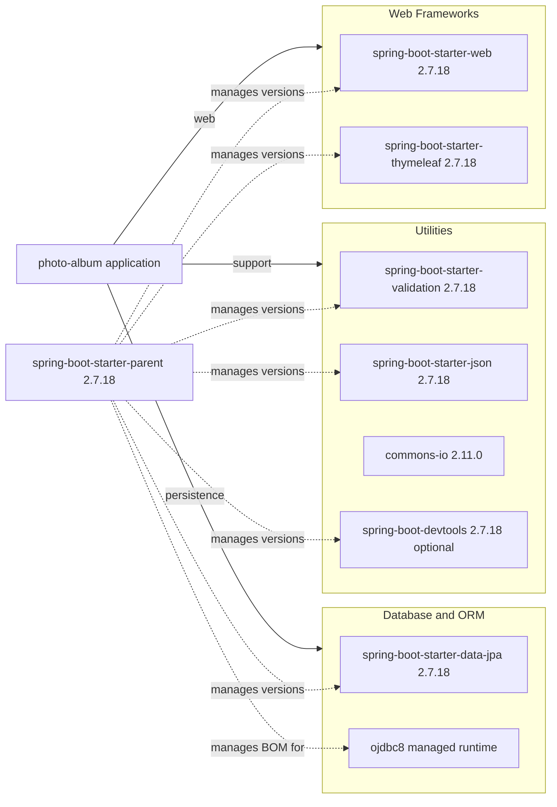

# Dependency Map

This project is a Spring Boot Maven application with 8 declared non-test dependencies plus 2 test-scoped dependencies. The dependency set is compact and centered around web delivery, JPA-based persistence, Oracle connectivity, and a small number of utility libraries.

## Dependencies

### Dependency Summary

| Category | Count | Key Libraries | Notes |
|---|---:|---|---|
| Web Frameworks | 2 | Spring Boot Web, Spring Boot Thymeleaf | Server-rendered MVC UI with template rendering |
| Database / ORM | 2 | Spring Data JPA, ojdbc8 | Hibernate-backed persistence against Oracle |
| Utilities | 4 | Validation, JSON, Commons IO, DevTools | Validation, JSON serialization, file helpers, and development reload support |

### Version & Compatibility Risks

The dependency set is tied to Spring Boot 2.7.18 and Java 8, both of which are older baselines for Azure modernization scenarios and are already highlighted by the generated AppCAT report. The Oracle JDBC runtime dependency also keeps the application closely coupled to Oracle-specific behavior, while the JPA repository contains native Oracle SQL that may complicate migration to other managed data platforms.

### Notable Observations

- The Spring Boot parent POM centrally manages nearly all starter versions, so framework upgrades will have broad impact across web, JPA, validation, and JSON support.
- `commons-io` is the only explicitly version-pinned third-party utility outside the Spring Boot managed dependency set.
- The application declares Oracle JDBC only at runtime scope, which is appropriate for deployment but still creates a hard production dependency on Oracle drivers.
- No dedicated messaging, caching, security, or observability libraries are declared in the build.

## Test Dependencies

| Framework | Version | Notes |
|---|---|---|
| `spring-boot-starter-test` | 2.7.18 | Provides JUnit 5 and the default Spring Boot test stack |
| `h2` | Spring Boot managed | In-memory database dependency used for tests |

Total test-scope dependencies: 2

The test toolchain is minimal and focused on application context startup validation. No dedicated integration-test libraries, containerized test dependencies, or contract-testing frameworks are declared.
