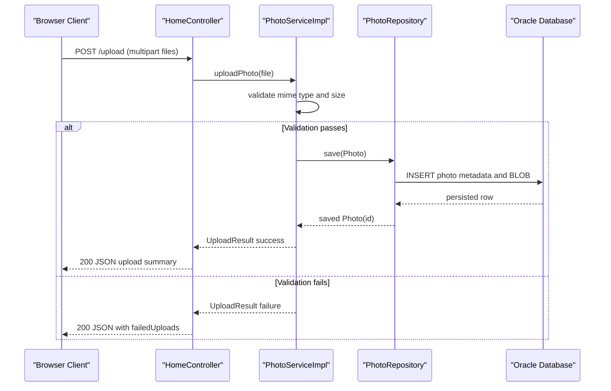

# API & Service Communication Contracts

The application exposes a compact HTTP surface with browser-facing endpoints for gallery browsing, upload, detail navigation, image retrieval, and deletion. Communication is synchronous within a single deployable service.

## Service Catalog

| Service | Port | Category | Purpose |
|---|---:|---|---|
| photo-album (single Spring Boot module) | 8080 | Business | Serves UI pages, upload API, and image delivery endpoints |

## API Endpoints Inventory

| Service | Method | Path | Request Type | Response Type |
|---|---|---|---|---|
| photo-album (`HomeController`) | GET | `/` | No body | HTML view (`index`) |
| photo-album (`HomeController`) | POST | `/upload` | Multipart `files[]` | JSON map with `success`, `uploadedPhotos`, `failedUploads` |
| photo-album (`DetailController`) | GET | `/detail/{id}` | Path param `id` | HTML view (`detail`) or redirect |
| photo-album (`DetailController`) | POST | `/detail/{id}/delete` | Path param `id` | Redirect to `/` with flash message |
| photo-album (`PhotoFileController`) | GET | `/photo/{id}` | Path param `id` | Binary resource with media type headers or 404/500 |

## Management & Observability Endpoints

| Service | Endpoint | Custom Metrics (if any) |
|---|---|---|
| photo-album | None explicitly declared in code/config | None detected |

## DTOs & Contracts

API contract objects include:
- `UploadResult` (mutable POJO): service-level upload outcome object used to represent success/failure and associated photo id.
- `Photo` (domain entity reused in API/view model): used for response data in controllers and template rendering.
- Upload response payload is composed as a dynamic `Map<String,Object>` with uploaded/failed item lists.

No OpenAPI/Swagger, GraphQL schema, or protobuf contract files were detected. Serialization relies on Spring Boot JSON/Jackson defaults.

## Communication Patterns

All service communication is synchronous request/response over HTTP between browser clients and the single backend service. Controllers delegate to `PhotoServiceImpl`, which performs transactional database work through `PhotoRepository`. No async messaging, circuit breaker, retry policy, or service discovery framework is present. API availability depends on datasource readiness; if Oracle is unavailable, persistence-backed operations fail. Security posture: no explicit authentication, authorization, or TLS enforcement is configured in application code.

## Service Technology Matrix

| Service | Web | Data Access | Discovery | Gateway | Actuator | Cache | Metrics |
|---|---|---|---|---|---|---|---|
| photo-album | Spring MVC + Thymeleaf | Spring Data JPA / Hibernate / Oracle JDBC | None | None | None detected | None detected | None detected |

## Service Communication Sequence

