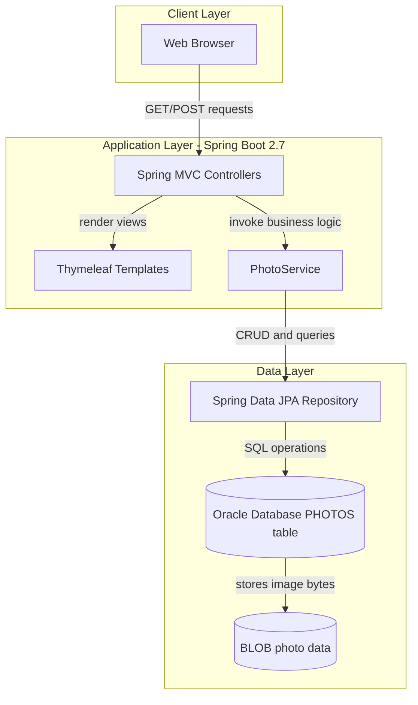
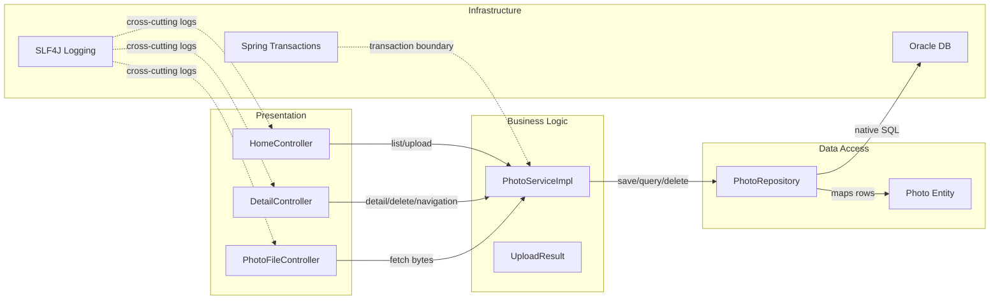

# Architecture Diagram

This application is a single Spring Boot web service that serves Thymeleaf pages and REST-style upload/file endpoints for photo management backed by an Oracle database.

## Application Architecture



### Technology Stack Summary

| Layer | Technology | Version | Purpose |
|---|---|---|---|
| Presentation | Spring MVC + Thymeleaf | Spring Boot 2.7.18 | Handles gallery UI and request routing |
| Business | Spring Service + Validation | Spring Boot 2.7.18 | Enforces upload rules and photo lifecycle operations |
| Data Access | Spring Data JPA + Hibernate | Spring Boot 2.7.18 | Repository abstraction and ORM integration |
| Data Store | Oracle JDBC (`ojdbc8`) | Runtime dependency | Persistent storage for metadata and BLOB image data |

### Data Storage & External Services

The primary runtime datastore is Oracle, with the `PHOTOS` table storing both metadata and raw image data in a BLOB column. Test executions use H2 in-memory storage via the test profile, and there are no outbound third-party API integrations in core request flows.

### Key Architectural Decisions

- Stores photo binary content directly in the database (`@Lob`) instead of serving from external object storage.
- Uses constructor injection and a thin-controller/service/repository layering to keep controller logic focused on HTTP concerns.
- Uses environment/profile-based datasource switching (`default`/`docker` runtime vs `test` profile with H2).

## Component Relationships



### Component Inventory

| Component | Layer | Type | Responsibility |
|---|---|---|---|
| HomeController | Presentation | MVC Controller | Renders gallery and handles batch upload requests |
| DetailController | Presentation | MVC Controller | Renders single photo detail and delete actions |
| PhotoFileController | Presentation | MVC Controller | Streams image binary content for `/photo/{id}` |
| PhotoServiceImpl | Business Logic | Service | Validates files, handles photo persistence and navigation operations |
| UploadResult | Business Logic | DTO | Captures per-file upload outcome for API responses |
| PhotoRepository | Data Access | Spring Data Repository | Executes CRUD and custom Oracle-native queries |
| Photo | Data Access | JPA Entity | Represents persisted photo metadata and image BLOB |
| Spring Transactions | Infrastructure | Framework Concern | Ensures atomic writes and consistent data operations |
| SLF4J Logging | Infrastructure | Cross-cutting Concern | Provides operational/error tracing across controllers and service |
```
