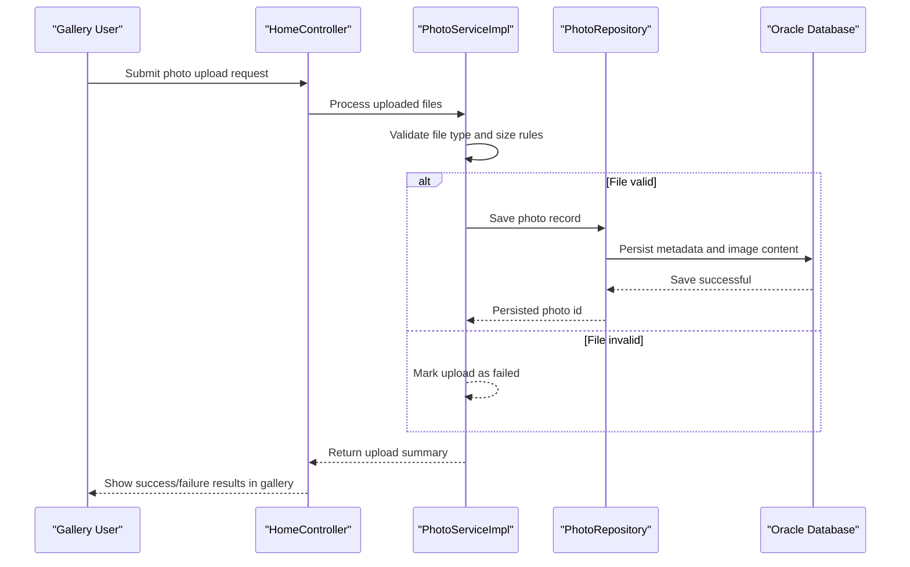

# Core Business Workflows

The application enables users to upload, browse, inspect, and delete photos in a lightweight gallery experience. Core workflows focus on validating uploads and managing a photo collection lifecycle.

## Domain Entities

| Entity | Service / Bounded Context | Description | Key Relationships |
|---|---|---|---|
| Photo | Photo Management | Canonical record for stored image content and metadata | Used by upload, gallery listing, detail viewing, and deletion workflows |
| UploadResult | Photo Management | Operation result object for per-file upload outcomes | Produced by upload workflow and aggregated into response payload |

## Service-to-Domain Mapping

| Service | Domain Context | Owned Entities | External Dependencies |
|---|---|---|---|
| photo-album | Photo Management | `Photo`, `UploadResult` | Oracle database via repository layer |

## Primary Workflows

### Workflow 1: Upload Photos to Gallery

Entry point: `POST /upload`
1. User selects one or more files and submits upload.
2. Service validates MIME type, file size, and non-empty content.
3. Service extracts image dimensions and prepares persisted `Photo` entity.
4. Repository saves metadata and binary content.
5. Response aggregates successful and failed files for user feedback.

### Workflow 2: Browse, View Detail, and Delete

Entry points: `GET /`, `GET /detail/{id}`, `POST /detail/{id}/delete`, `GET /photo/{id}`
1. Gallery page requests photo list sorted by newest uploads.
2. Detail page resolves specific photo plus previous/next navigation candidates.
3. Binary endpoint streams image bytes for rendering.
4. Delete action removes selected photo and returns to gallery with status message.

## Cross-Service Data Flows

No cross-service composition is present. All workflow data is owned and served by a single service and one backing datastore, so business responses are assembled internally without downstream service joins or fallback routing.

## Business Workflow Sequence

## Business Rules & Decision Logic

- Uploads must be image MIME types from an allowed list and within configured maximum size.
- Empty files are rejected before persistence.
- Navigation logic selects previous/next photos based on upload timestamp ordering.
- Deletion only succeeds when the target photo exists; otherwise user receives not-found feedback.
- Transaction boundary is at service layer (`@Transactional`) to keep write operations consistent.
