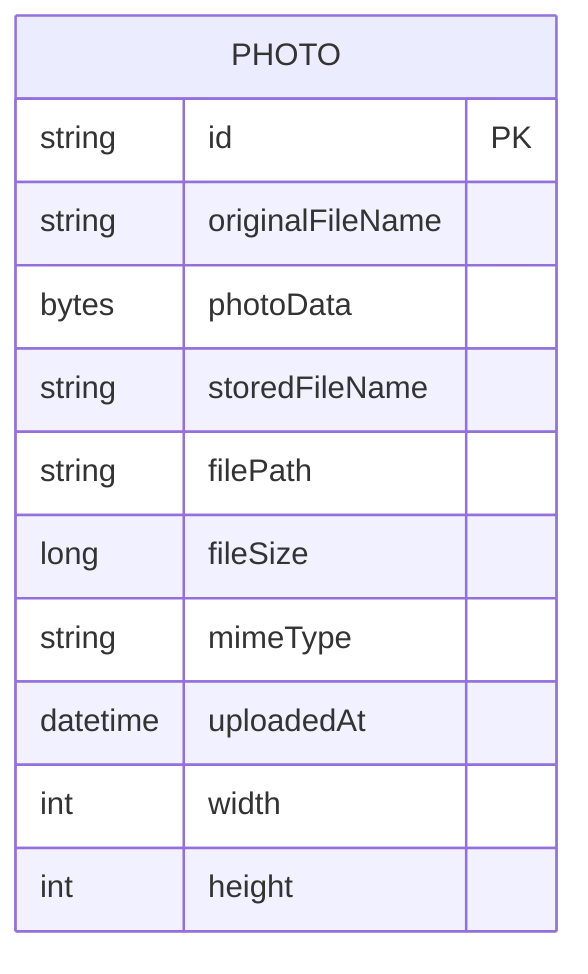

# Data Architecture & Persistence Layer

The data layer centers on a single relational model for photo metadata and binary image content using JPA/Hibernate. Runtime persistence uses Oracle, while tests use an in-memory H2 profile.

## Database Configuration

| Service/Module | DB Type | Profile | Driver | Connection | Migration Tool |
|---|---|---|---|---|---|
| photo-album | Oracle | default | Oracle JDBC | Oracle service host and port in datasource URL | None detected |
| photo-album | Oracle | docker | Oracle JDBC | Containerized Oracle endpoint in datasource URL | None detected |
| photo-album (tests) | H2 in-memory | test | H2 Driver | In-memory JDBC URL | None detected |

## Data Ownership per Service

| Service | Tables Owned | ORM Framework | Caching | Notes |
|---|---|---|---|---|
| photo-album | `PHOTOS` | Spring Data JPA / Hibernate | None detected | Stores both metadata and image BLOB in one table |

## Entity Model

## Key Repository Methods

| Service | Repository | Notable Methods | Purpose |
|---|---|---|---|
| photo-album | `PhotoRepository` (`src/main/java/com/photoalbum/repository/PhotoRepository.java`) | `findAllOrderByUploadedAtDesc()` | Returns gallery list newest first |
| photo-album | `PhotoRepository` | `findPhotosUploadedBefore(LocalDateTime)` | Fetches older photos for previous navigation |
| photo-album | `PhotoRepository` | `findPhotosUploadedAfter(LocalDateTime)` | Fetches newer photos for next navigation |
| photo-album | `PhotoRepository` | `findPhotosByUploadMonth(String,String)` | Oracle-specific month filtering |
| photo-album | `PhotoRepository` | `findPhotosWithPagination(int,int)` | Oracle `ROWNUM` pagination window |
| photo-album | `PhotoRepository` | `findPhotosWithStatistics()` | Uses analytic functions for ranking and running totals |

## Caching Strategy

No explicit cache provider or Spring cache annotations were found. Reads and writes are executed directly through repository/database access within transactional service methods.

## Data Ownership Boundaries

The application uses a shared single-database and single-service topology: one service both owns and accesses all persisted photo data. There is no cross-service data access pattern, CQRS split, or inter-service aggregation at the data layer.

### Data Classification & Sensitivity

| Entity | Sensitive Fields | Classification (PII/PHI/PCI/None) | Controls in Place |
|---|---|---|---|
| `Photo` | `originalFileName` (may contain user-identifying text), `photoData` (image content may include personal data) | PII (potential) | No explicit encryption-at-rest, masking, or field-level access control configured in code |
| `Photo` | No payment or medical attributes detected | None for PCI/PHI | N/A |
