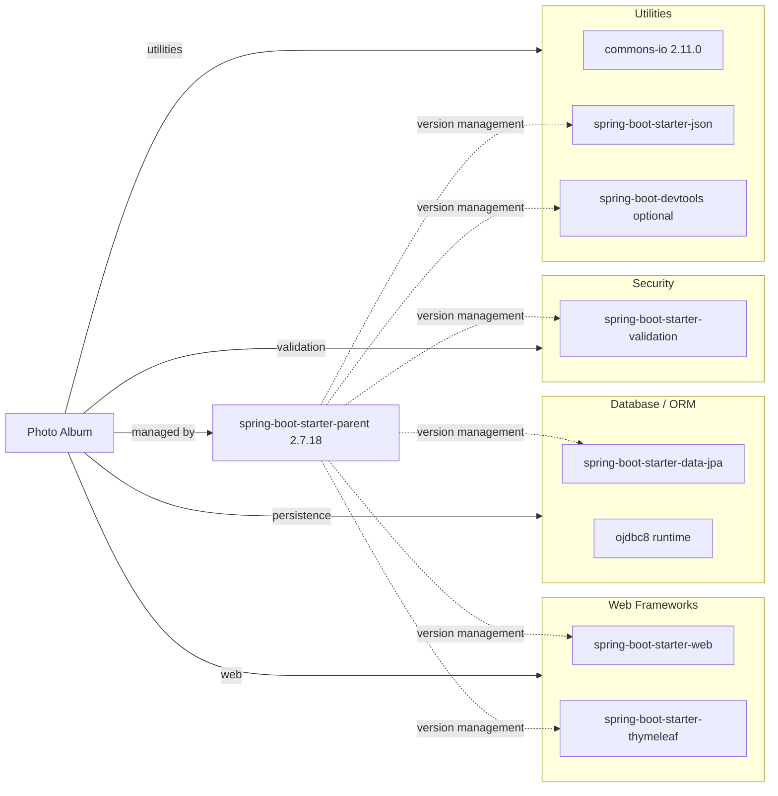

# Dependency Map

Photo Album declares 8 non-test dependencies and 2 test-scope dependencies in a single Maven module.

## Dependencies

### Dependency Summary

| Category | Count | Key Libraries | Notes |
|---|---:|---|---|
| Web Frameworks | 2 | `spring-boot-starter-web`, `spring-boot-starter-thymeleaf` | Server-rendered MVC application |
| Database / ORM | 2 | `spring-boot-starter-data-jpa`, `ojdbc8` | JPA/Hibernate with Oracle runtime driver |
| Security | 1 | `spring-boot-starter-validation` | Bean validation for upload constraints |
| Utilities | 3 | `commons-io`, `spring-boot-starter-json`, `spring-boot-devtools` | JSON support, file IO helper, local dev hot reload |

### Version & Compatibility Risks

The project targets Java 8 and Spring Boot 2.7.x, both of which are older baselines for modernization. Oracle-specific native SQL in repositories and reliance on `ojdbc8` can increase migration effort if moving to another database engine or newer framework stack.

### Notable Observations

- Dependency versions are mostly managed by the Spring Boot parent BOM, reducing manual version drift risk.
- The runtime DB dependency is Oracle-specific, and several repository queries use Oracle syntax (`ROWNUM`, `NVL`, `TO_CHAR`).
- No dedicated observability or messaging libraries are declared; the system is a synchronous, single-service web app.

## Test Dependencies

| Framework | Version | Notes |
|---|---|---|
| spring-boot-starter-test | Managed by Spring Boot 2.7.18 | Includes JUnit 5 and Spring test support |
| h2 | Managed by Spring Boot 2.7.18 | In-memory database used by `test` profile |

Total test-scope dependencies: 2
The test stack is minimal but sufficient for context-load and repository-backed integration testing with an embedded DB.
