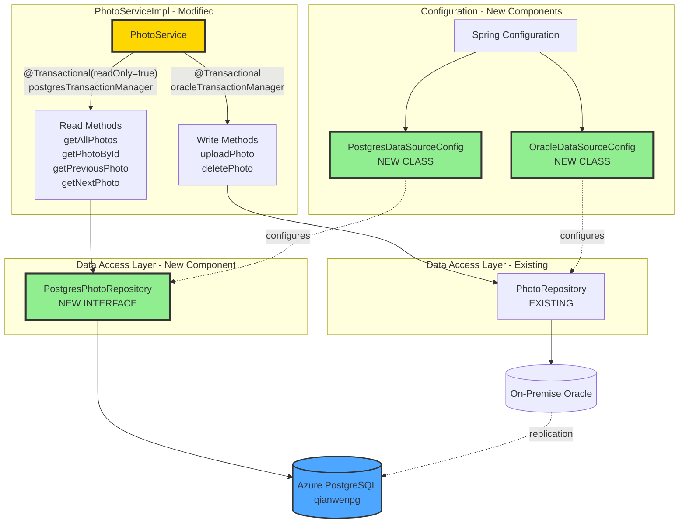

# Migration Plan: Hybrid Oracle/Azure PostgreSQL Architecture

**Project**: PhotoAlbum Java Application  
**Migration stratege**: code + local verify + azure verify
**Date**: December 4, 2025  
**Branch**: `appmod/java-oracle-to-postgresql-20251202173044`

---

## Overview

This migration transitions the PhotoAlbum application to a hybrid database architecture to improve read performance and scalability. The application currently uses a single on-premise Oracle database for all operations. The new architecture will:

- **Maintain existing write operations** on the on-premise Oracle database to preserve data integrity and minimize disruption
- **Redirect read operations** to a cloud-based Azure PostgreSQL database to improve performance and reduce load on the primary database
- **Ensure data consistency** between the two databases through synchronization mechanisms

The migration follows a phased approach: first establishing cloud infrastructure, then creating comprehensive tests to validate behavior, followed by code changes to implement the dual-database pattern, and finally deploying to Azure with full validation against production endpoints.

---

## Services

### Azure PostgreSQL
- **Resource ID**: `/subscriptions/{subscription-id}/resourceGroups/qianwens/providers/Microsoft.DBforPostgreSQL/flexibleServers/qianwenpg`
- **Server Name**: `qianwenpg.postgres.database.azure.com`
- **Database**: `photoalbum`
- **Authentication**: Managed Identity / Username-Password
- **Purpose**: Read operations and replicated data storage

### Azure Container App
- **Resource ID**: `/subscriptions/{subscription-id}/resourceGroups/qianwens/providers/Microsoft.App/containerApps/{app-name}`
- **Container Registry**: To be provisioned during deployment
- **Purpose**: Host PhotoAlbum application with dual-database connectivity

---

## Architecture Design

### Impacted Components



**Legend:**
- 🟢 **Green**: New components to be created
- 🟡 **Yellow**: Existing components to be modified
- **Gray**: Unchanged components


## Code Migration

Break down the migration into features with this granularity:
- One feature per complete service migration (configuration + implementation)
- Each feature can be evaluated with integration tests
- No modifications to unimpacted code or existing functionality
- Steps: Update code → Unit test → Fix → Integration test → Validate

### Feature: Photo Read Service Migration to Azure PostgreSQL

**Description**: Configure Azure PostgreSQL infrastructure and migrate all photo read operations (gallery, detail, BLOB serving, navigation) from Oracle to Azure PostgreSQL.

**Steps**:
1. **Code**: 
   - Verify Azure PostgreSQL exists, create schema, sync data, add JDBC driver
   - Create `OracleDataSourceConfig.java` and `PostgresDataSourceConfig.java`
   - Create `PostgresPhotoRepository.java` (all read methods, convert Oracle→PostgreSQL queries)
   - Update `PhotoServiceImpl.java` (route reads to PostgreSQL)
2. **Unit Test**: 
   - `PostgresConnectionTest.java` - verify connectivity, schema, dual datasource init
   - `PostgresPhotoRepositoryTest.java`, `PhotoReadServiceTest.java` - verify routing, BLOB handling, queries
   - Run: `mvn test -Dtest=PostgresConnectionTest,*PhotoRead*`
3. **Integration Test**: 
   - `.github/modernization/commands/test-infra.sh` - validate both datasources accessible
   - `PhotoReadIntegrationTest.java` - test `GET /`, `/detail/{id}`, `/photo/{id}`, navigation
   - Run workflow

---

## Containerization

### Update Dockerfile
- Verify existing `Dockerfile` builds with new PostgreSQL dependencies
- Ensure multi-stage build includes PostgreSQL JDBC driver
- Test local Docker build: `docker build -t photoalbum-java:latest .`
- Run container locally to verify dual-database connectivity

### Create Docker Compose for Testing (Optional)
- Add PostgreSQL service to `docker-compose.yml` for local testing
- Configure environment variables for both Oracle and PostgreSQL
- Test: `docker-compose up` and verify application starts

---

## Deployment

### Create Deployment Script
- Update or create `azure-deploy.ps1`:
  - Build application: `mvn clean package -DskipTests`
  - Build Docker image
  - Tag image for Azure Container Registry
  - Push to ACR: `docker push <acr>.azurecr.io/photoalbum-java:latest`
  - Deploy to Azure App Service or Container App
  - Configure environment variables for dual datasources

### Deploy to Azure Container App
- Provision Container App in resource group `qianwens`
- Configure connection to:
  - Azure PostgreSQL `qianwenpg` (reads)
  - On-premise Oracle (writes - via VPN/ExpressRoute)
- Set environment variables:
  ```
  SPRING_DATASOURCE_POSTGRESQL_URL=jdbc:postgresql://qianwenpg.postgres.database.azure.com:5432/photoalbum
  SPRING_DATASOURCE_ORACLE_URL=jdbc:oracle:thin:@<oracle-host>:1521/FREEPDB1
  ```
- Deploy: `az containerapp create ...`

### Run Integration Tests Against Azure Endpoint
- Update `.github/modernization/commands/test-azure.sh`:
  - Set `BASE_URL` to Azure Container App URL
  - Test all endpoints against production
- Test photo gallery: `curl -I $BASE_URL/`
- Test photo detail: `curl -I $BASE_URL/detail/{id}`
- Test photo serving: `curl -I $BASE_URL/photo/{id}`
- Test upload: `curl -X POST -F "file=@test.jpg" $BASE_URL/upload`
- Test delete: `curl -X POST $BASE_URL/detail/{id}/delete`
- Verify all tests return HTTP 200/302 status

### Validation
- ✅ All read operations query Azure PostgreSQL
- ✅ All write operations persist to Oracle
- ✅ Integration tests pass against Azure endpoint
- ✅ Application logs show both datasources connected
- ✅ No errors in Azure Application Insights

---

## Dependencies and Prerequisites

1. **Azure Subscription**: Active subscription with resource group `qianwens`
2. **Azure PostgreSQL**: Server `qianwenpg` provisioned and accessible
3. **On-Premise Oracle**: Running and accessible (for writes)
4. **Development Tools**:
   - Java 8+ JDK
   - Maven 3.x
   - Docker (for image build)
   - Azure CLI
   - Git
5. **Network Access**:
   - Connectivity to on-premise Oracle
   - Connectivity to Azure PostgreSQL
   - Firewall rules configured
6. **Credentials**:
   - Oracle database credentials
   - Azure PostgreSQL credentials
   - Azure subscription credentials
