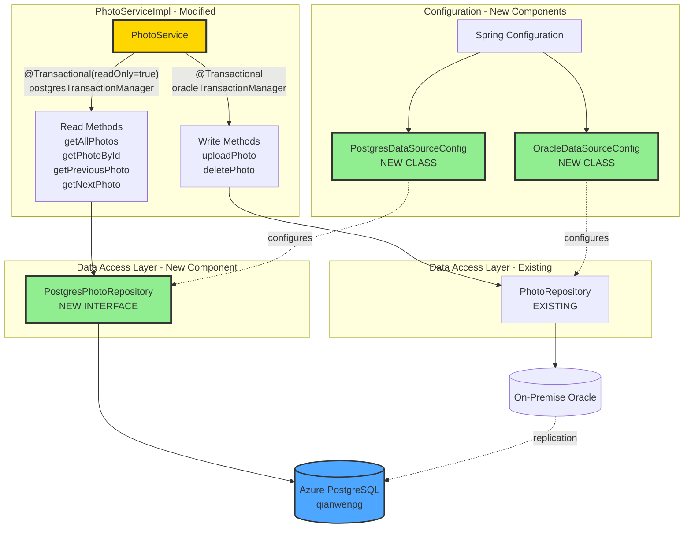

# Migration Plan: Hybrid Oracle/Azure PostgreSQL Architecture

**Project**: PhotoAlbum Java Application  
**Migration stratege**: code + local verify + azure verify
**Date**: December 4, 2025  
**Branch**: `appmod/java-oracle-to-postgresql-20251202173044`

---

## Overview

This migration transitions the PhotoAlbum application to a hybrid database architecture to improve read performance and scalability. The application currently uses a single on-premise Oracle database for all operations. The new architecture will:

- **Maintain existing write operations** on the on-premise Oracle database to preserve data integrity and minimize disruption
- **Redirect read operations** to a cloud-based Azure PostgreSQL database to improve performance and reduce load on the primary database
- **Ensure data consistency** between the two databases through synchronization mechanisms

The migration follows a phased approach: first establishing cloud infrastructure, then creating comprehensive tests to validate behavior, followed by code changes to implement the dual-database pattern, and finally deploying to Azure with full validation against production endpoints.

---

## Services

### Azure PostgreSQL
- **Resource ID**: `/subscriptions/{subscription-id}/resourceGroups/qianwens/providers/Microsoft.DBforPostgreSQL/flexibleServers/qianwenpg`
- **Server Name**: `qianwenpg.postgres.database.azure.com`
- **Database**: `photoalbum`
- **Authentication**: Managed Identity / Username-Password
- **Purpose**: Read operations and replicated data storage

### Azure Container App
- **Resource ID**: `/subscriptions/{subscription-id}/resourceGroups/qianwens/providers/Microsoft.App/containerApps/{app-name}`
- **Container Registry**: To be provisioned during deployment
- **Purpose**: Host PhotoAlbum application with dual-database connectivity

---

## Architecture Design

### Impacted Components

**Legend:**
- 🟢 **Green**: New components to be created
- 🟡 **Yellow**: Existing components to be modified
- **Gray**: Unchanged components

## Code Migration

### Modernize Feature: Photo Read Service Migration to Azure PostgreSQL

**Description**: Configure Azure PostgreSQL infrastructure and migrate all photo read operations (gallery, detail, BLOB serving, navigation) from Oracle to Azure PostgreSQL.

**Steps**:
1. **Code**: Configure dual datasources (Oracle for writes, PostgreSQL for reads), create PostgreSQL repository with converted queries, update service layer to route read operations to PostgreSQL
2. **Unit Test**: Verify PostgreSQL connectivity, dual datasource initialization, PostgreSQL repository read methods, and read transaction routing
3. **Integration Test**: Validate both datasources accessible, test all read endpoints (gallery, detail, photo serving, navigation) against local environment

---

## Containerization

**Purpose**: Package the application into a Docker container image for deployment to Azure.

**Dockerfile Location**: `./Dockerfile` (existing)

---

## Deployment

**Deployment Script**: `azure-deploy.ps1` (update or create)

**Script Actions**:
- Build application: `mvn clean package -DskipTests`
- Build and tag Docker image for Azure Container Registry
- Push image to ACR: `docker push <acr>.azurecr.io/photoalbum-java:latest`
- Provision Azure Container App (only if not provided by user)
- Configure environment variables for dual datasources (PostgreSQL and Oracle connections)
- Deploy container to Azure Container App

**Integration Test**: Run `PhotoReadIntegrationTest.java` against Azure Container App endpoint to validate deployed application

